# NoSQL分类

NoSQL大体上可以分为4种类型: **key-value、Document-Oriented\Column-Family DataBases、Graph-Oriented Databases**

## Key-value(键值)数据库

键值数据库就像在传统语言中使用的哈希表。可以通过key来添加、查询或删除、鉴于使用主键访问、所以会获得不错的性能及扩展性。

常见的产品有: **Riak、Redis、Memcache**等。

使用场景: **存储用户信息(会话、配置文件、参数等等)**

* 如果查询是通过值进行的，则不适用该数据库
* 需要存储数据之间的关系，则不适用该数据库
* 事务支持，键值数据库中事务支持不好

## Document-Oriented(面向文档)数据库

将数据以文档的形式存储，每个文档都是自包含的数据单元，是一系列数据项的集合。每个数据项都有一个名称与对应值

常见产品: **MongoDB、CouchDB**等

使用场景: **日志、分析**

* 在不同的文档上添加事务

## 列存储数据库

将数据存储在列族中，一个列族存储经常被一起查询的相关数据。

使用场景: **日志，博客平台**

* 不支持事务和原型设计

## 图数据库

# redis

## 命令安装

```
yum install -y redis
```

## 编译安装

```shell
wget https://download.redis.io/releases/redis-5.0.11.tar.gz

tar -xf redis-5.0.11.tar.gz

cd redis-5.0.11

make

make test
```

## 编译生成的可执行文件

```shell
redis-benchmark  # 性能测试
redis-check-aof  # 检查修复aof文件
redis-check-rdb  # 检查修复rdb文件
redis-cli        # redis的客户端
redis-sentinel   # redis的集群
redis-server     # redis的服务端
redis-trib.rb    # 集群管理
```

## 启动redis

```shell
./src/redis-server # 默认端口是6379，默认启动会占用终端
```

## 性能测试

默认是100000,50个同时发起连接

```shell
./src/redis-benchmark -q

PING_INLINE: 73855.24 requests per second
PING_BULK: 73800.73 requests per second
SET: 74074.07 requests per second
GET: 72833.21 requests per second
INCR: 73637.70 requests per second
LPUSH: 73855.24 requests per second
RPUSH: 70175.44 requests per second
LPOP: 72202.16 requests per second
RPOP: 74183.98 requests per second
SADD: 74962.52 requests per second
HSET: 75642.96 requests per second
SPOP: 73746.31 requests per second
LPUSH (needed to benchmark LRANGE): 74850.30 requests per second
LRANGE_100 (first 100 elements): 48379.30 requests per second
LRANGE_300 (first 300 elements): 24172.11 requests per second
LRANGE_500 (first 450 elements): 18670.65 requests per second
LRANGE_600 (first 600 elements): 15384.62 requests per second
MSET (10 keys): 78186.08 requests per second
```

## 连接redis

```shell
./src/redis-cli
```

* `-h` ip地址
* `-p` 端口
* `-s` 套接字
* `-a` 密码
* `-n` 指定redis的库

`redis`的命令是不区分大小写

## 命令

1. `ping`: 测试redis连接是否成功，返回`pong`表示成功

2. `info`: 查看系统信息

3. `echo`: 输出指定内容

4. `quit exit`: 退出连接

5. `select n`: 选择第`n`个数据库

## redis中的数据类型

- `string`：字符串
- `hash`
- `list`：列表
- `set`：集合
- `zset`：有序集合

### 全局key操作

|命令|作用|
|:---:|:---:|
|`del key`|删除`key`|
|`exists key`|判断`key`是否存在，存在为`1`，不存在为`0`|
|`expire key seconds`|设置过期时间, 过期自动删除|
|`ttl key`|返回`key`的剩余生存时间,`-1`表示永久存在，`-2`表示不存在|
|`persist key`|移除指定`key`的生存时间|
|`pexpire key millseconds`|设置过期时间，以毫秒为单位|
|`pttl key`|查看`key`的生存周期，毫秒为单位|
|`keys pattern`|查看满足`patter`规则的所有`key`, 支持模糊匹配|
|`type key`|查看`key`类型|
|`move key n`|移动`key`到`n`号数据库|
|`rename key newkey`|改名, `key`不存在报错，`newkey`存在则覆盖|
|`renamenx key newkey`|改名, `key`不存在报错，`newkey`存在则不进行操作|
|`randomkey`|随机获取一个`key`|

### string命令

|命令|作用||
|:---:|:---:|:---:|
|`set key value [ex seconds][px millseconds] [nx][xx]`|设置`key-value`，可以设置过期时间|`ex or px`: 过期时间; `nx`：key不存在设置，`xx`：`key`存在才操作|
|`get key`|获取`key`对应的值|`key`不存在返回`nil`|
|`mset key1 value1 [key2 value2 ...]`|设置多组值|该操作为原子操作，要么全成功，要么全失败|
|`mget key1 [key2 key3 ...]`|获取多组值||
|`getset key value`|获取指定`key`，并设置为`value`|`key`不能存在返回`nil`|
|`strlen key`|获取`key`对应的`value`的长度||
|`apppend key value`|在`key`对应`value`后面追加额外的`value`|`key`存在则追加，`key`不存在则新建|
|`incr key`|将`key`对应的数字加上`1`| `key`存在则进行加值操作，否则设置为`1`|
|`decr key`|将`key`对应的数字减去`1`|`key`存在则进行减值操作，否在设置为`-1`|
|`incrby key amount`|将`key`对应的数字加上`amount`|`amount`默认为1, key存在则进行加值操作，否则设置为`amount`|
|`decrby key amount`|将`key`对应的数字减去`amount`|`amount`默认为1，key存在则进行减值操作，否在设置为`-amount`|
|`getrange key start end`|`key`对应`value`进行切片操作|`[start, end]`|
|`incrbyfloat key amount`|增值操作，`amount`为浮点数|末日保留17位小数|

### list操作命令

> - 列表的元素类型为string，
> - 按照插入顺序排序

| 命令 | 作用 | 其他 |
|:---: |:---:|:---:|
|`lpush key value [value ...]`| 在头部插入数据|`key`不存在则创建|
|`lpushx key value [value...]`| 在头部插入数据|`key`不存在则不进行任何操作|
|`rpush key value [value ...]`| 在尾部添加数据|`key`不存在则创建|
|`rpushx key value [value...]`| 在尾部添加数据|`key`不存则不进行任何操作|
|`lindex key index`           | 返回列表中索引为`index`的元素的值| `index`从`0`开始，当`index`超出索引时返回`null` |
|`linsert key [before after] value1 value2`|在`value1`前面或后面插入`value2`|`value1`不存在则不进行任何操作|
|`lrange key start stop`      | 查看索引范围内元素的值||
|`llen key`                   | 返回列表的长度||
|`lrem key count value`       | 删除`value`，`count`表示删除次数|`count=0`删除所有，`count>0`从前到后删除`count`个, `count<0`从后到前删除`count`个|
|`ltrim key start end`        | 移除没有在`[start, end]`之间的元素值||
|`lset key index newvalue`    | 指定索引号进行修改||
|`lpop key`                   | 从头部删除数据，返回删除的数据 |`key`不存在返回`nil`|
|`rpop key`                   | 从尾部删除数据，返回删除的数据 ||

### hash操作命令

> * 是一个键值(`key=>value`)对集合。
> * 是`string` 类型的 `field` 和 `value` 的映射表，`hash` 特别适合用于存储对象, `field` 域, `value` 值

| 命令| 作用| 其他 |
| :---: | :---: | :---: |
| `hset key field value`                       | 将`field-value`设置到`key`指定`hash`表中 | 若`key`不存在会新建hash表再赋值，已存在则会覆盖； |
| `hsetnx key field value`                     | 将`field-value`设置到`key`指定`hash`表中 | 若`field`以存在则操作无效，`field`不存在则新增|
| `hmset key field1 value1[field2 value2 ...]` | 同时将多个`field-value`设置到`key`指定`hash`表中 ||
| `hget key field`                             | 获取`value`值||
| `hmget key field[field...]`                  | 获取多个`value`||
| `hvals key`                                  | 获取全部`value`||
| `hkeys key`                                  | 获取所有的`field`||
| `hgetall key`                                | 获取全部`field` 和 `value`||
| `hlen key`                                   | 查看有几个键值对||
| `hexists key field`                          | 判断hash表中指定`field`是否存在| 若存在，则返回1；若key或field不存在，则返回0    |
| `hdel key field [field ...]`                 | 删除`key`中的`field`||
| `hexists key field`                          | 判断`key`中是否存在`field`|0表示不存在，1表示存在|
| `hincrby key field amount`                   | 对`key`中`field`对应的`value`进行增值操作||


### set操做命令

> * 元素为string类型
> * 无序集合
> * 元素具有唯一性，不重复 

| 命令 | 作用 | 其他 |
| :---: | :---: | :---: |
| `sadd key member [member...]` | 将一个或多个`member`元素加入到集合key中 | 若member已存在那么会忽略此元素 |
| `scard key`                   | 返回集合`key`中元素的个数 | |
| `smembers key`                | 获取集合`key`中所有元素 | |
| `sismember key member`        | 判断集合存在某个值 | 判断`member`在`key`中是否已存在, 返回0或1 |
| `srem key member [member...]` | 移除一个或多个元素 | 不存在的member会被忽略，返回被移除元素个数|
| `spop key [count]`            | 随机删除 | |
| `sdiff key1 key2`             | 求集合`key1`与集合`key2`差集|`key1-key2`|
| `sinter key1 key2`            | 求集合`key1`与集合`key2`的交集||
| `sunion key1 key2`            | 求集合`key1`与结合`key2`的并集||
| `smove src dst value`         | 将集合`src`中的`value`移动到集合`dst`|`dst`如果不存则新建， `src`如果不存在则不进行操作|
| `srandmenber key count`       | 随机获取`key`中的`count`个元素| `count`默认为 `1`|


### zset操作命令
> * 类似于Set
> * 不同的是Sorted中的每个成员都分配了一个分数（Score）用于对其中的成员进行排序（升序）。
> * zset的成员是唯一的,但分数(score)却可以重复。

| 命令                                         | 作用                              | 其他                    |
| -------------------------------------------- | --------------------------------- | ----------------------- |
| `zadd key score member [ [score member] ..]` | 添加数据                          | 存在就更新              |
| `zscore key member`                          | 查看`score`值                       |                         |
| `zrange key start stop[withscores]`          | 按索引返回`key`的成员               | `withscores`表示显示`score` |
| `zrangebyscore key min max`                  | 返回集合中 `score` 在给定区间的元素 |                         |
| `zrem key member [member...]`                | 移除有序集合中的一个或多个元素    | 若`member`不存在则忽略    |
| `zremrangebyrank min max`                    | 删除集合中索引在给定区间的元素    |                         |
| `zremrangebyscore  min max`                  | 删除集合中 `score` 在给定区间的元素 |                         |


# 发布订阅

* `subscribe channel [channel ...]`: 订阅`channel`频道
* `publish channel message`: 向`channel`频道发布消息
* `psubscribe pattern [pattern ...]`: 订阅满足`pattern`的频道，支持通配符
* `pubsub subcommand`: 执行子命令
	* `pubsub channels`: 查看当前活跃的频道
	* `pubsh numsub channel`: 查看订阅`channel`频道的人数
	* `pubsub numpat`: 返回订阅模式的数量

# redis配置文件
`grep -v '^$' redis.conf | grep -v '^#'`
```shell
bind 127.0.0.1  # 监听的地址
protected-mode yes  # 运行在安全模式下
port 6379  # 端口
tcp-backlog 511
timeout 0
tcp-keepalive 300
daemonize no  # 非守护进程，占用终端
supervised no
pidfile /var/run/redis_6379.pid
loglevel notice  # 日志级别
logfile ""
databases 16  # 数据库个数
always-show-logo yes
save 900 1  # 900s内有1次更新，就会持久化
save 300 10 # 300s内有10次更新，就会持久化
save 60 10000  # 60s内有10000次更新，就会持久化
stop-writes-on-bgsave-error yes
rdbcompression yes
rdbchecksum yes
dbfilename dump.rdb  # 数据保存的文件
dir ./
replica-serve-stale-data yes
replica-read-only yes
repl-diskless-sync no
repl-diskless-sync-delay 5
repl-disable-tcp-nodelay no
replica-priority 100
lazyfree-lazy-eviction no
lazyfree-lazy-expire no
lazyfree-lazy-server-del no
replica-lazy-flush no
appendonly no
appendfilename "appendonly.aof"
appendfsync everysec
no-appendfsync-on-rewrite no
auto-aof-rewrite-percentage 100
auto-aof-rewrite-min-size 64mb
aof-load-truncated yes
aof-use-rdb-preamble yes
lua-time-limit 5000
slowlog-log-slower-than 10000
slowlog-max-len 128
latency-monitor-threshold 0
notify-keyspace-events ""
hash-max-ziplist-entries 512
hash-max-ziplist-value 64
list-max-ziplist-size -2
list-compress-depth 0
set-max-intset-entries 512
zset-max-ziplist-entries 128
zset-max-ziplist-value 64
hll-sparse-max-bytes 3000
stream-node-max-bytes 4096
stream-node-max-entries 100
activerehashing yes
client-output-buffer-limit normal 0 0 0
client-output-buffer-limit replica 256mb 64mb 60
client-output-buffer-limit pubsub 32mb 8mb 60
hz 10
dynamic-hz yes
aof-rewrite-incremental-fsync yes
rdb-save-incremental-fsync yes

requirepass password # 给redis设置密码
```
* `auth password`: 密码认证

# redis主从复制
只需要在**从服务器**上进行配置(在redis配置文件中添加)
```shell
slaveof ip port  # 指定主服务器的ip和端口
masterauth <password>  # 验证主服务器密码，没有密码则不需要
```
`config set masterauth password`: 从服务器执行，校验主服务器密码

- **基于异步**的，平均每秒钟从服务器都会主服务器发送复制的情况
- 一个主可以多个从
- 不止主服务器可以有从服务器，从服务器也可以有从服务器
- 复制功能不会阻塞主服务器
- 复制功能也不会阻塞从服务器

# redis数据持久化
数据持久化的方式有两种: `rdb`和`aof`

## `rdb`方式
```shell
save 900 1  # 900s内有1次更新，就会持久化
save 300 10 # 300s内有10次更新，就会持久化
save 60 10000  # 60s内有10000次更新，就会持久化
stop-writes-on-bgsave-error yes
rdbcompression yes
rdbchecksum yes
dbfilename dump.rdb  # 数据保存的文件
dir ./  # 数据保存的目录
```
* **优点**
	- 生成二进制文件
	- 系统会默认的多长时间保存一次
	- 直接手动保存
	- 制作快照
	- 可以用作备份
	- 比较适合做灾难恢复
	- 主进程会`fork`一个子进程出来，子进程用来负责保存数据
	
* **缺点**
	- 如果说数据需要 *尽量保存* 下来，则不适合实用rdb
	- 在数据量庞大的时候，对系统消耗过大

* `save` 保存数据

* `flushall` 删除数据
* `flushdatabase`

## `aof`方式
- **优点**
  - 持久化更好, 数据实时保存
  - `aof`将所有的操作都追加到一个文件中，`redis-check-aof`修复`aof`文件
  - 文件易读
	
- **缺点**
  - 文件会越来越大
  - `aof`的速度会比`rdb`慢，`aof`使用的是`fsync`
  - 文件易读

`aof`数据持久化配置
```shell
appendonly yes
appendfilename "appendonly.aof"
appendfsync everysec  # 每秒添加
```

## 直接通过命令从rdb切换到aof
在redis中执行如下命令
```shell
config set appendonly yes
config set save ""
```


# redis高可用

在 WEB 服务器中，**高可用**是指**服务器正常访问的时间**，衡量标准在**多长时间内可以提供正常服务**。

在 Redis 层面，**高可用**除了保证提供**正常服务(主从分离、快速容灾技术等)**，还需要考虑**数据容量扩展、数据安全**等

在 Redis 中，实现**高可用**的技术主要包括**持久化、复制、哨兵、集群**
* **持久化**: 持久化是 *最简单* 的高可用方法。主要作用是**数据备份**，即将数据存储在硬盘，保证数据不会因进程退出而丢失

* **复制**: 复制是redis高可用的基础，**哨兵**和**集群**都是在**复制的基础**上实现的高可用。复制主要实现了数据的多机备份以及
  对于读操作的负载均衡和简单的故障恢复。缺陷是故障恢复无法自动化，写操作无法负载均衡，存储受到单机的限制

* **哨兵**: 复制基础上，哨兵实现了**自动化的故障恢复**。 缺陷是 **写操作** 无法负载均衡，存储能力收单机限制
	* 在每台redis服务器上启动哨兵进程，从服务器哨兵监控主服务器哨兵；当主服务器哨兵宕机后，从服务器哨兵会选择一个从服务器作为主服务器

* **集群**: 通过集群，redis解决了写操作无法负载均衡以及存储能力受单机限制问题，实现了完善的高可用方案


## 哨兵

****
## Redis集群

`Redis Cluster`集群模式通常具有 **高可用、可扩展性、分布式、容错**等特性。`Redis`分布式方案一般有两种

### 客户端分区方案
**客户端**自己决定数会被 **存储** 在哪个 `redis` 节点或者从那个 `redis` 节点**读取数据**。主要思想是采用 **哈希算法** 将`redis`
数据的`key`进行散列，通过`hash`函数，特定的`key`会映射到特定的`redis`节点上。
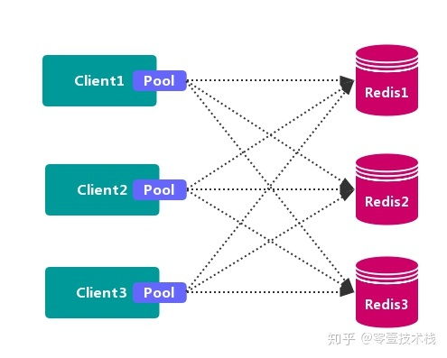
客户端分区方案代表为**Redis Sharding**，是**Redis Cluster**出来之前，业界普遍使用的redis多实例集群方案。

* 优点： 不使用第三方中间件，分区逻辑可控，配置简单，节点之间无关连，线性扩展容易，灵活性强

* 缺点: 客户端**无法动态增删**服务节点，客户端需要**自行分发逻辑**，客户端之间**无连接共享**，会造成连接浪费。

### 代理分区方案
客户端发送请求到一个 **代理组件**，**代理**解析客户端的数据，并将请求转发至正确的节点，最后将结果回复给客户端
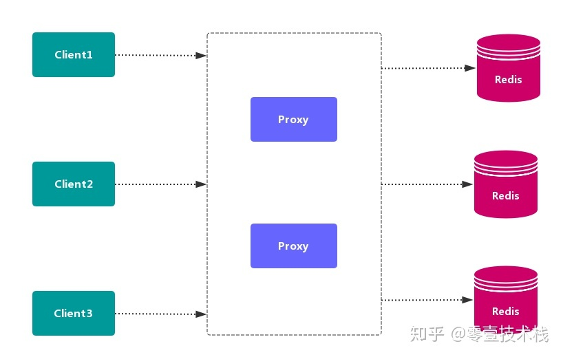
* 优点: 简化客户端分布式逻辑，客户端透明接入，切换成本低，代理的转发和存储分离

* 缺点：多了一层代理层，加重了架构部署复杂度和性能损耗

代理分区主流实现方案有: **`Twemproxy`和`Codis`**

#### Twemproxy

`Twemproxy` 也叫 `nutcraker`, 是`twitter`开源的一个`redis`和`memcache`的**中间代理服务器**程序。可以接受来自多个程序
的访问，按照**路由规则**，转发给后台各个Redis服务器，再原路返回。存在**单点故障问题**，需要结合`lvs`和`keepalived`做高可用方案

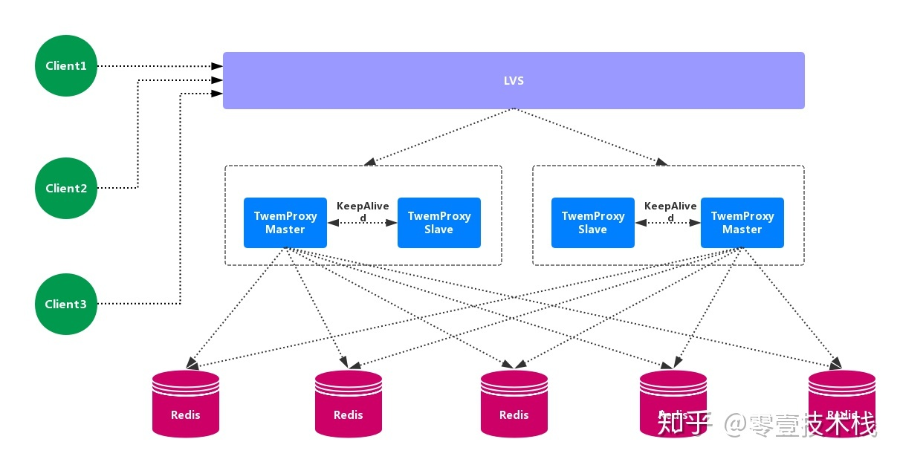

* 优点: 应用范围广，稳定性较高，**中间代理层** 高可用
* 缺点: 无法平滑地**水平扩容**，无 **可视化界面管理**，运维不友好；出现故障，不能自动转移

#### Codis
`codis`是一个分布式redis解决方案，对于上层应用而言，连接`codis-proxy`和直接连接原生地`redis-server`没有区别。`Codis`
底层会处理请求地转发，不停机地进行数据迁移等工作。`codis`采用了无状态代理层，对于客户端而言，一切都是透明地。

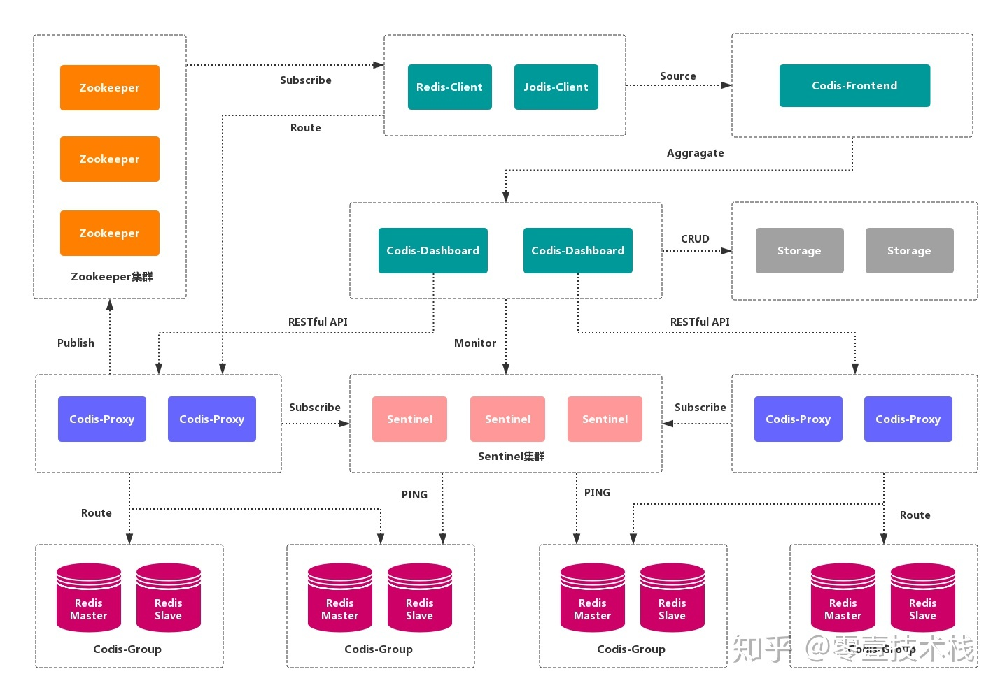

* 优点: 实现上层proxy和底层redis地高可用，数据分片和自动平衡，提供命令接口和`restful API`. 提供监控和管理界面，可以动态添加和删除redis节点
* 缺点: 部署架构和配置复杂，不支持跨机房和多租户，不支持鉴权管理。

### 查询路由方案
**客户端随机**地请求任意一个`redis`实例，然后由`Redis`将请求转发给正确地`redis`节点。`Redis Cluster`实现了一种呼和形式地查询路由，
但并不是直接将请求从一个`Redis`节点转发到另一个`redis`节点，而是再客户端地帮助下直接重定向到正确地`redis`节点

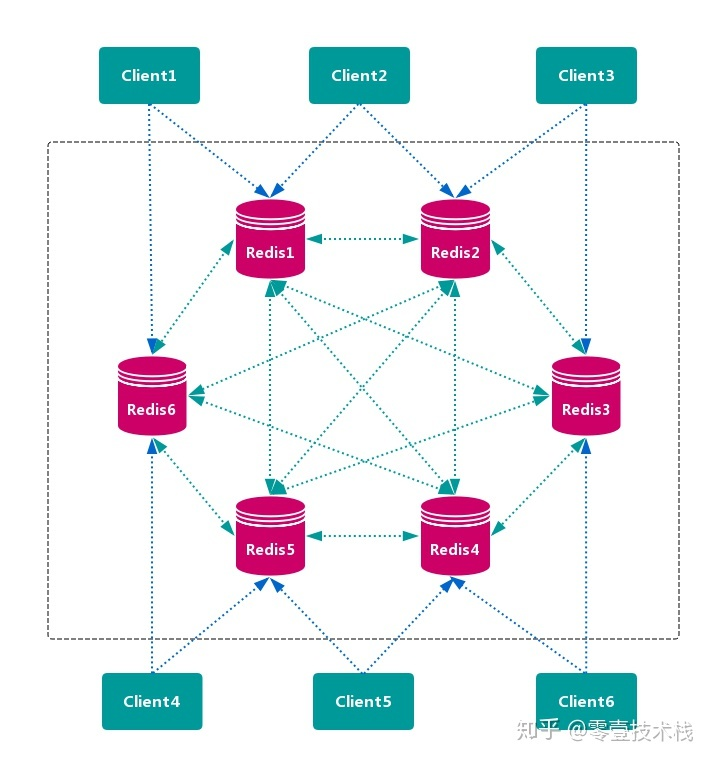

* 优点： **无中心节点**，数据按照 *槽* 存储分布在多个 `Redis` 实例上，可以平滑的进行节点 **扩容/缩容**，支持 **高可用** 和 **自动故障转移**，运维成本低。

* 缺点: 严重依赖 `Redis-trib` 工具，缺乏 **监控管理**，需要依赖 `Smart Client` (**维护连接，缓存路由表**，`MultiOp` 和 `Pipeline` 支持)。`Failover` 节点的 **检测过慢**，不如 **中心节点** ZooKeeper 及时。Gossip 消息具有一定开销。无法根据统计区分 **冷热数据**。

****
## 数据分布

### 数据分布理论
**分布式数据库** 首先要解决把 **整个数据集** 按照 **分区规则** 映射到 **多个节点** 的问题，
即把 **数据集** 划分到 **多个节点** 上，每个节点负责 **整体数据** 的一个 **子集**。

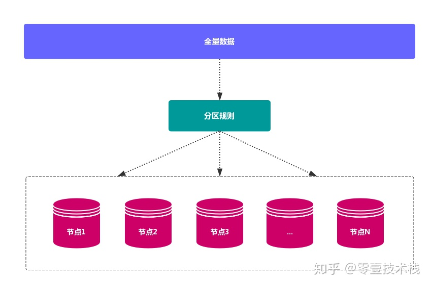
数据分布通常有 **哈希分区** 和 **顺序分区** 两种方式
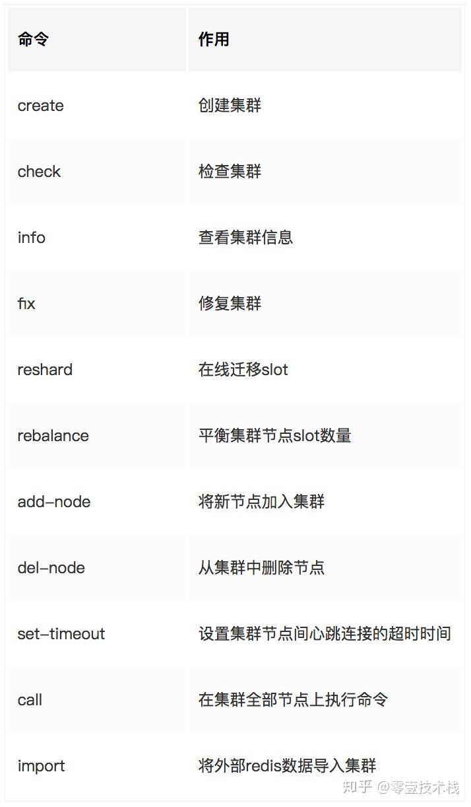
由于 `Redis Cluster` 采用 **哈希分区规则**，这里重点讨论 **哈希分区**。常见的 **哈希分区** 规则有几种，下面分别介绍：

#### 节点取余法
使用特定的数据，如 Redis 的 **键** 或 **用户 ID**，再根据 节点数量 `N` 使用公式：`hash（key）% N` 计算出 **哈希值**，
用来决定数据 **映射** 到哪一个节点上。
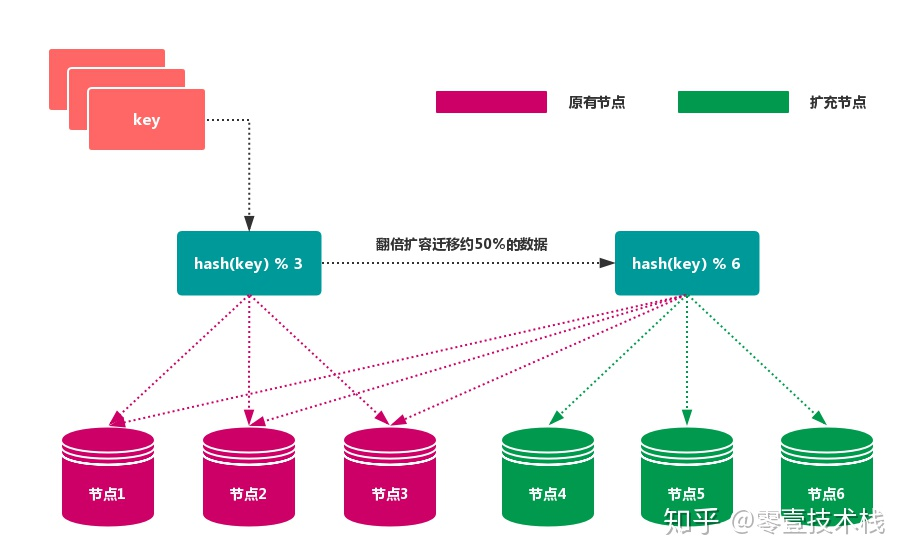

* **优先**：突出优点是 **简单性**，常用于 **数据库** 的 **分库分表规则**。一般采用 **预分区** 的方式，提前根据 **数据量** 规划好 **分区数**
  比如划分为 512 或 1024 张表，保证可支撑未来一段时间的 **数据容量**，再根据 **负载情况** 将 **表** 迁移到其他 **数据库** 中。
  扩容时通常采用 **翻倍扩容**，避免 **数据映射* 全部被 **打乱**，导致 **全量迁移** 的情况。
  
* **缺点**: 当 **节点数量** 变化时，如 **扩容** 或 **收缩** 节点，数据节点 **映射关系** 需要重新计算，会导致数据的 **重新迁移**

#### 一致性哈希分区

**一致性哈希** 可以很好的解决 **稳定性问题**，可以将所有的 **存储节点** 排列在 **首尾相接** 的 `Hash` 环上，
每个 `key` 在计算 `Hash` 后会 **顺时针** 找到 **临接** 的 **存储节点** 存放。而当有节点 **加入** 或 **退出** 时，
仅影响该节点在 `Hash` 环上 **顺时针相邻** 的 **后续节点**
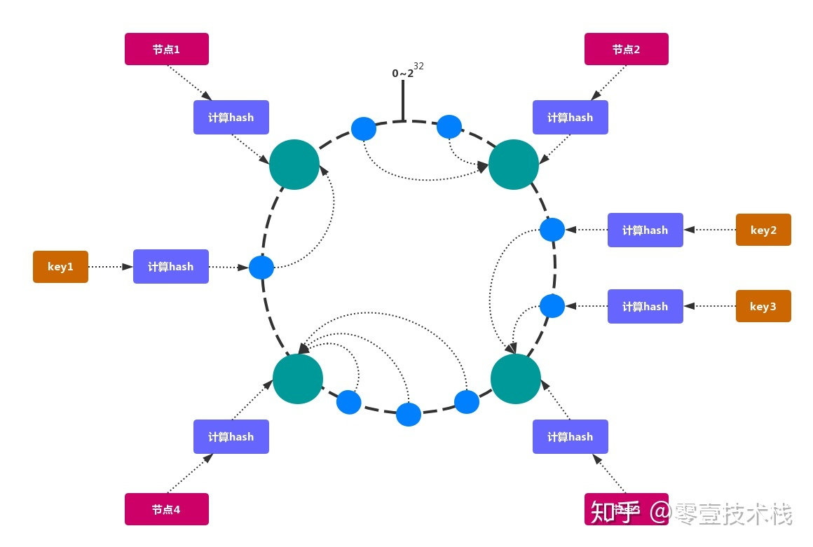

* 优点: **加入** 和 **删除** 节点只影响 **哈希环** 中 **顺时针方向** 的 **相邻的节点**，对其他节点无影响。
* 缺点: **加减节点** 会造成 **哈希环** 中部分数据 **无法命中**。当使用 **少量节点** 时，
  **节点变化** 将大范围影响 **哈希环** 中 **数据映射**，不适合 **少量数据节点** 的分布式方案。**普通** 的 **一致性哈希分区** 
  在增减节点时需要 **增加一倍** 或 **减去一半** 节点才能保证 **数据** 和 **负载的均衡**。
  
> 注意：因为 一致性哈希分区 的这些缺点，一些分布式系统采用 **虚拟槽** 对 **一致性哈希** 进行改进，比如 Dynamo 系统。

#### 虚拟槽分区
**虚拟槽分区** 巧妙地使用了 **哈希空间**，使用 **分散度良好** 的 **哈希函数** 把所有数据 **映射** 到一个 **固定范围** 的 整数集合 中，
整数定义为 **槽**（`slot`）。这个范围一般 **远远大于** 节点数，比如 `Redis Cluster` 槽范围是 `0 ~ 16383`。
**槽** 是集群内 **数据管理** 和 **迁移** 的 **基本单位**。采用 **大范围槽** 的主要目的是为了方便 **数据拆分** 和 **集群扩展**。
每个节点会负责 **一定数量的槽**，如图所示：

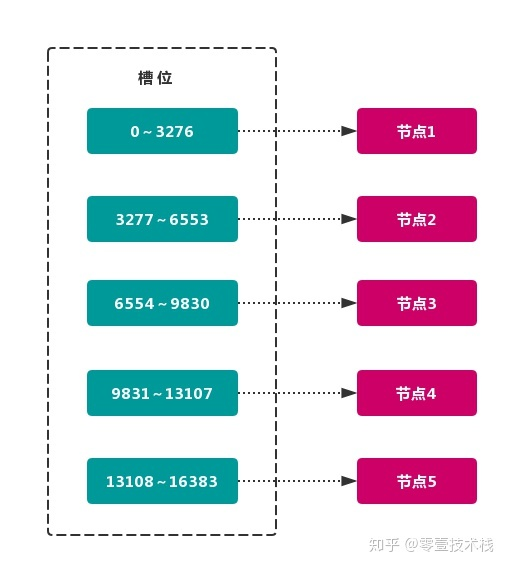

当前集群有 5 个节点，每个节点平均大约负责 3276 个 **槽**。
由于采用 **高质量** 的 **哈希算法**，每个槽所映射的数据通常比较 **均匀**，
将数据平均划分到 5 个节点进行 **数据分区**。`Redis Cluster` 就是采用 **虚拟槽分区**。

* 节点1： 包含 0 到 3276 号哈希槽。
* 节点2：包含 3277 到 6553 号哈希槽。
* 节点3：包含 6554 到 9830 号哈希槽。
* 节点4：包含 9831 到 13107 号哈希槽。
* 节点5：包含 13108 到 16383 号哈希槽

这种结构很容易 **添加** 或者 **删除** 节点。如果 **增加** 一个节点 `6`，就需要从节点 `1 ~ 5` 获得部分 **槽** 分配到节点 `6 `上。
如果想 **移除** 节点 `1`，需要将节点 `1` 中的 **槽** 移到节点 `2 ~ 5` 上，然后将 **没有任何槽** 的节点 1 从集群中 **移除** 即可。

> 由于从一个节点将 **哈希槽** 移动到另一个节点并不会 **停止服务**，
> 所以无论 **添加删除** 或者 **改变** 某个节点的 **哈希槽的数量** 都不会造成 **集群不可用** 的状态.

### Redis的数据分区
`Redis Cluster` 采用 **虚拟槽分区**，所有的 **键** 根据 **哈希函数** 映射到 `0~16383` 整数槽内，
计算公式：$slot = CRC16（key）% 16383$。每个节点负责维护一部分槽以及槽所映射的 **键值数据**，

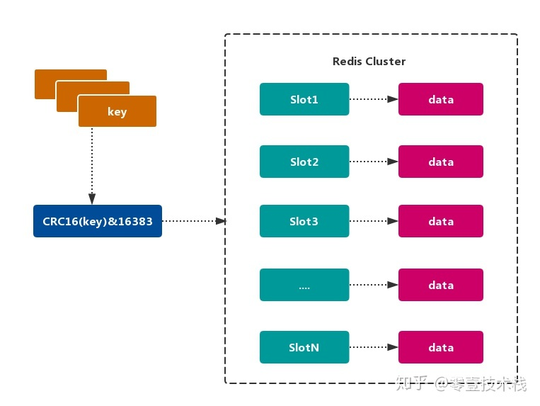

#### Redis虚拟槽分区的特点
* 解耦 **数据** 和 **节点** 之间的关系，简化了节点 **扩容** 和 **收缩** 难度。
* 节点自身 **维护槽的** 映射关系，不需要 **客户端** 或者 **代理服务** 维护 **槽分区元数据**。
* 支持 **节点、槽、键** 之间的 **映射查询**，用于 **数据路由、在线伸缩** 等场景。

### Redis集群的功能限制
Redis 集群相对 **单机** 在功能上存在一些限制，需要 开发人员 提前了解，在使用时做好规避。

* `key` **批量操作** 支持有限
  
	类似 `mset、mget` 操作，目前只支持对具有相同 `slot` 值的 `key` 执行 **批量操作**。对于 **映射为不同** `slot` 值的
    `key` 由于执行 `mset、mget` 等操作可能存在于多个节点上，因此不被支持.
  
* `key` **事务操作** 支持有限。

	只支持 **多** `key` 在 **同一节点上** 的 **事务操作**，当多个 `key` 分布在 **不同** 的节点上时 **无法** 使用事务功能。

* `key` 作为 **数据分区** 的最小粒度

	不能将一个 **大的键值** 对象如 `hash、list` 等映射到 **不同的节点**。

* 不支持 **多数据库空间**

	**单机** 下的 `Redis` 可以支持 `16` 个数据库（db0 ~ db15），**集群模式** 下只能使用 **一个** 数据库空间，即 `db0`。

* **复制结构** 只支持一层

	从节点 **只能复制** 主节点，不支持 **嵌套树状复制** 结构

****

## redis集群配置
`Redis-Cluster` 是 `Redis` 官方的一个 **高可用** 解决方案，`Cluster` 中的 `Redis` 共有 `2^14（16384）` 个 `slot` **槽**。 
创建 `Cluster` 后，**槽** 会 **平均分配** 到每个 `Redis` **节点上**。

下面介绍一下本机启动 6 个 `Redis` 的 **集群服务**，并使用 `redis-trib.rb` 创建 **3主3从** 的 集群。
搭建集群工作需要以下三个步骤：

### 第一步、准备节点

`Redis` 集群一般由 **多个节点** 组成，节点数量至少为 `6` 个，才能保证组成 **完整高可用** 的集群。
每个节点需要 **开启配置** `cluster-enabled yes`，让 `Redis` 运行在 **集群模式** 下。

集群节点规划如下
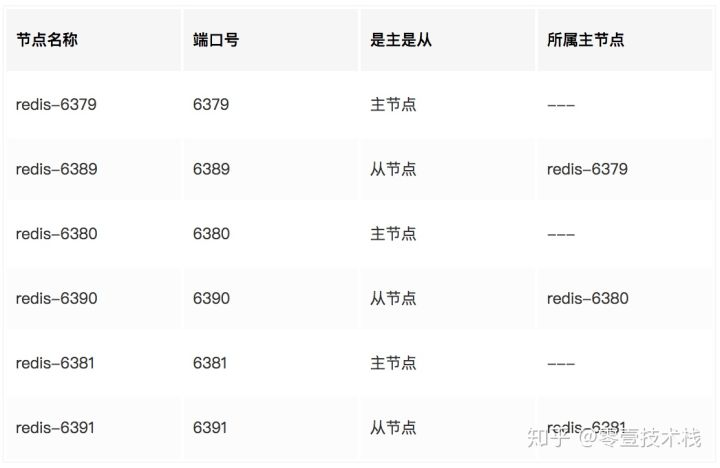

