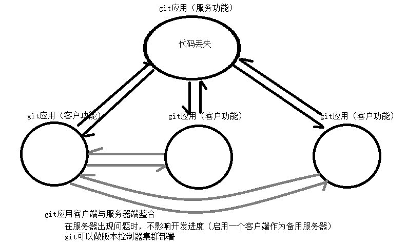
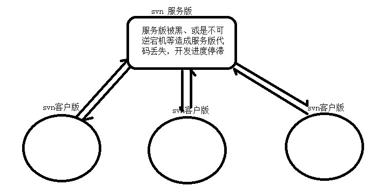
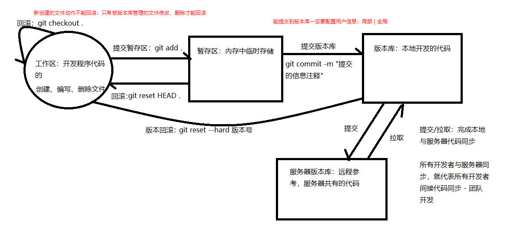
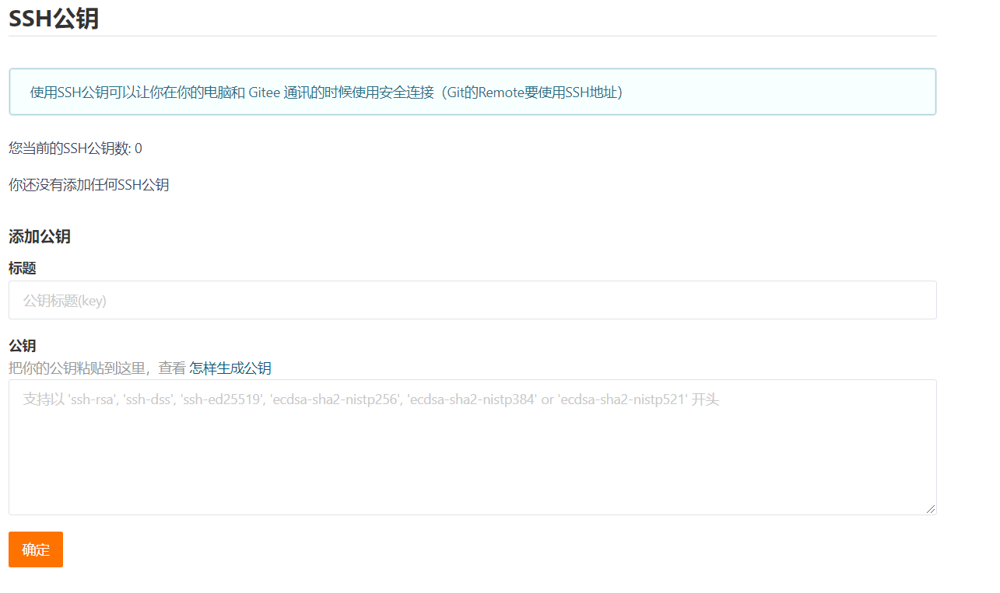

# 一、版本控制工具


`git`是一个分布式的版本控制软件。


与另外一个版本控制软件svn对比，svn是集中式管理代码。


## 1.1 git工作流程


本地git划分了三个区域**工作区、暂存区、版本库** 和 **远程版本库**

* 工作区: 被git管理后，用于编写代码的区域。在工作区需要创建、修改、删除文件。
   * 工作区回滚: `git checkout .`<font style="color: red;">新建文件动作不能回滚，
     只有被版本管理的文件修改、删除才能回滚</font>
   * 提交到暂存区: `git add .` 
   
* 暂存区: 开发完成后，展示保存代码的地方，此时还没被版本管理
   * 提交到版本库: `git commit -m 提交信息`
   * 暂存区回滚: `git reset HEAD .`，移除暂存区
   
* 版本库: 本地开发出来的代码(本地代码仓库)。
   * 版本回滚: `git reset -- hard 版本号`，<font color='gree'>回滚到指定版本</font>

* 远程版本库: 远程服务器上的代码仓库
   * 提交到远程仓库
   * 拉取到本地仓库

## 1.2 git分支管理
分支: <font color="yellowgreen">项目开发的时间轴，一个时间节点代表版本库中的一个版本</font>

**分支开发是独立的，不去影响其他分支**，要将子分支开发的内容同步到主分支时，完成分支合并即可。


## 1.3 基本命令

1. `git init [目录]`: 初始化仓库

2. `git status`: 查看仓库状态

3. `git add 文件`: 提交文件到暂存区

4. `git commit -m "messag"`: 提交到版本库
    * 提交到库时需要有作者信息
        ```git
        git config [--global] user.name "name"
        git config [--global] user.email "email"
        ```
        * `--global`: 表示全局作者信息，没有则仅对当前仓库有效。
        * 会在用户家目录下生成`.gitconfig`文件
    
5. `git checkout 文件`: 文件回滚到被管理的最新版本

6. `git log`: 查看版本管理日志

7. <font color="yellowgreen">`git reset --hard 版本号`: 回滚到指定的版本状态</font>
## 1.4 忽略文件

指定某些文件或文件夹不被git管理，**<font color="red">默认不管理空文件夹</font>**

在`.git`所在的目录下面新建`.gitignore`按如下语法编写需要忽略的文件或文件夹
```gitignore
# 注释

#忽略文件夹
文件夹
#忽略文件
文件

# 忽略文件夹中.py结尾的文件
文件夹/*.py

# 当前路径下的文件或文件夹
/文件
/文件夹
```

## 1.5 分支操作

1. `git branch`: 查看分支

2. `git branch 分支名`: 创建分支
   
3. `git branch -d 分支名`: 删除分支

4. `git checkout 分支名`: 切换分支

5. `git checkout -b 分支名`: 创建并切换到创建的分支

6. `git merge 分支名`: 合并分支(当前分支合并指定分支)

## 1.6 冲突

1. 分支合并时出现冲突

2. 不同的开发者修改同一分支同一文件的同一行

## 1.7 git远程仓库
1. `git remote`: 查看远程仓库地址

2. `git remote add 链接名 地址`: 添加远程仓库

3. `git push 链接名 分支名`: 提交到远程仓库指定的分支

4. `git clone 地址`: 克隆到本地

5. `git pull 链接名 分支名`: 从链接指定的远程仓库的指定分支拉取代码

**<font color="red">提交代码之前，必须先拉取代码(更新)</font>**

### 1.7.1 新建仓库
```shell
mkdir git_learn
cd git_learn
git init  # 初始化仓库
touch README.md  # 新建文件
git add README.md  ## 添加到暂存区
git commit -m "first commit"  # 提交到本仓库
git remote add origin https://gitee.com/duyupeng36/git_learn.git  # 添加远程链接
git push -u origin master  # 提交
```

### 1.7.2 已有长裤
```shell
cd existing_git_repo
git remote add origin https://gitee.com/duyupeng36/git_learn.git
git push -u origin master
```

## 1.8 ssh链接远程仓库
### 1.8.1 介绍非对称加密

非对称加密原理是，
1. 寻找两个质数 $P$ 和 $Q$ 
2. 计算 $P$ 和 $Q$ 的最小公倍数 $N$
3. 计算$φ(N) = (P-1)(Q-1)$，
4. 计算公钥E: 公钥必须满足 $1 < E < φ(N)$ 且 $E$ 与 $φ(N)$ 互为质数，
5. 计算私钥D: 私钥 $E * D % φ(N) = 1$
6. 加密: $C ＝ M^E mod N$; $C$是加密后的密文，$M$是明文, 
7. 解密: $M ＝C^D mod N$; $C$是密文, $M$解密出来的明文

### 1.8.2 使用ssh链接远程仓库
1. 创建ssh公钥: `ssh-keygen -t 加密算法 -C "内容"`
    * 生成到用户家目录下的.ssh文件夹里面

2. 将公钥给远程仓库


打开家目录下的`.ssh/id_rsa.pub`，中的内容复制添加到上面区