# numpy基础
### numpy概述

1. `Numerical Python`，数值的`Python`，补充了`Python`语言所欠缺的数值计算能力。
2. `Numpy`是其它数据分析及机器学习库的底层库。
3. `Numpy`完全标准`C`语言实现，运行效率充分优化。
4. `Numpy`开源免费。

### numpy历史

1. `1995`年，`Numeric，Python`语言数值计算扩充。
2. 2001年，`Scipy->Numarray`，多维数组运算。
3. 2005年，`Numeric+Numarray->Numpy`。
4. 2006年，`Numpy`脱离`Scipy`成为独立的项目。

### numpy的核心：多维数组

1. 代码简洁：减少`Python`代码中的循环。
2. 底层实现：厚内核(`C`)+薄接口(`Python`)，保证性能。

### numpy核心ndarry
* `ndarray` 内部由以下内容组成：
    * 一个指向数据（内存或内存映射文件中的一块数据）的指针。

    * 数据类型或 `dtype`，描述在数组中的固定大小值的格子。

    * 一个表示数组形状（`shape`）的元组，表示各维度大小的元组。

    * 一个跨度元组（`stride`），其中的整数指的是为了前进到当前维度下一个元素
      需要"跨过"的字节数。
      

      
## 一 创建数组

### numpy.array方式
该方式需要指定数据元素

`numpy.array(object, dtype = None, copy = True, order = None, subok = False, ndmin = 0)`
* `object`: `ndarray,iterable,int,float`
* `dtype`: 数组元素的数据类型，可选
* `copy`: 对象是否需要复制，可选
* `order`: 创建数组的样式，`C`为行方向，`F`为列方向，`A`为任意方向（默认）
* `subok`: 默认返回一个与基类类型一致的数组
* `ndmin`: 指定生成数组的最小维度

```python
import numpy as np
np.array([1,2,3,4])
```
### numpy.arange方式
类似与range函数参数一个一维序列。

`numpy.arange(start,end,step)`
* start: 开始位置，默认0
* end: 结束位置
* step: 步长，默认1

```python
import numpy as np

np.arange(0, 10, 2)
```

### numpy.zeros方式
创建元素全为0的数组

`np.zeros(shape, dtype='类型')`
* shape: 维度

```python
import numpy as np

np.zeros((2, 3), dtype='i4')
```

### numpy.ones方式
创建元素全为1的数组

`np.ones(shape, dtype='类型')`
* shape: 维度

```python

import numpy as np

np.ones((2, 3), dtype='i1')
```

### numpy.linspace方式
线性拆分

`np.linspace(start, end, num)`
* `start`: 开始位置
* `end`: 结束位置
* `num`: 拆分出的点个数

```python

import numpy as np

np.linspace(0, 10, 20)
```

### numpy.logspace方式
等比拆分

`np.logspace(start, end, num, base=10)`
* `start`: 以$base^{start}$开始
* `end`: 以$base^{end}$结束
* `num`: 拆分出的点个数

```python

import numpy as np

np.logspace(0, 2, 5)
```

## 二 ndarray对象的基本属性

### ndim
ndim表示的是数组的轴向个数。也即是维数

### shape
shape表示数组的维度。是一个元组类型的数据。直接修改就可以修改数组的维度
```python
import numpy as np

ary = np.arange(0,10)
ary.shape = (5, 2)
print(ary)
```

### size
size表示数组中元素的个数，等于shape中每个元素的乘积
```python

import numpy as np

ary = np.arange(0,10)
ary.shape = (5, 2)

print(ary.size)  # 10 == 5 * 2
```

### itemsize
itemsize表示的数组中元素占用的字节大小

```python

import numpy as np

ary = np.arange(0,10)
ary.shape = (5, 2)

print(ary.itemsize)
```

### dtype
dtype指定数组元素的数据类型

```python

import numpy as np

ary = np.arange(0,10)
ary.shape = (5, 2)

print(ary.dtype)
```


## 三 numpy基本数据类型
|数据类型|简写|说明|
|:---:|:---:|:---:|
|`bool`||用一个字节存储的布尔类型（True或False）
|`int`|	|由所在平台决定其大小的整数（一般为int32或int64）
|`int8`|`i1`|一个字节大小，-128 至 127
|`int16`|`i2`|整数，-32768 至 32767
|`int32`|`i4`|整数，-2 ** 31 至 2 ** 32 -1
|`int64`|`i8`|整数，-2 ** 63 至 2 ** 63 - 1
|`uint8`|`u1`|无符号整数，0 至 255
|`uint16`|`u2`|无符号整数，0 至 65535
|`uint32`|`u4`|无符号整数，0 至 2 ** 32 - 1
|`uint64`|`u8`|无符号整数，0 至 2 ** 64 - 1
|`float16`|`f2`|半精度浮点数：16位，正负号1位，指数5位，精度10位
|`float32`|`f4`|单精度浮点数：32位，正负号1位，指数8位，精度23位
|`float64或float`|`f8`|双精度浮点数：64位，正负号1位，指数11位，精度52位
|`complex64`|`c8`|复数，分别用两个32位浮点数表示实部和虚部
|`complex128或complex`|`c16`|复数，分别用两个64位浮点数表示实部和虚部
|`str_`|`U<字符数>`|每个字符用`32`位`Unicode`编码表示|
|`datetime64`|`M8[Y] M8[M] M8[D] M8[h] M8[m] M8[s]`|表示时间日期类型|

**类型字符码格式**

| 格式      | 释义                                                         |
| -------- | ------------------------------------------------------------ |
| `3i4`      | 大端字节序，3个元素的一维数组，每个元素都是整型，每个整型元素占4个字节。 |
| `<(2,3)u8` | 小端字节序，6个元素2行3列的二维数组，每个元素都是无符号整型，每个无符号整型元素占8个字节。 |
| `U7`       | 包含7个字符的Unicode字符串，每个字符占4个字节，采用默认字节序。 |

### 3.1 dtype设置

```python
# 自定义复合类型
import numpy as np

data=[
	('zs', [90, 80, 85], 15),
	('ls', [92, 81, 83], 16),
	('ww', [95, 85, 95], 15)
]
#第一种设置dtype的方式
a = np.array(data, dtype='U3, 3int32, int32')
print(a)
print(a[0]['f0'], ":", a[1]['f1'])
print("=====================================")

#第二种设置dtype的方式
b = np.array(data, dtype=[('name', 'str_', 2),
                    ('scores', 'int32', 3),
                    ('ages', 'int32', 1)])
print(b[0]['name'], ":", b[0]['scores'])
print("=====================================")

#第三种设置dtype的方式
c = np.array(data, dtype={'names': ['name', 'scores', 'ages'],
                    'formats': ['U3', '3int32', 'int32']})
print(c[0]['name'], ":", c[0]['scores'], ":", c.itemsize)
print("=====================================")


#第四种设置dtype的方式  
d = np.array(data, dtype={'name': ('U3', 0),
                    'scores': ('3i4', 16),
                    'age': ('i4', 28)})
print(d[0]['names'], d[0]['scores'], d.itemsize)

print("=====================================")

#第五种设置dtype的方式
e = np.array([0x1234, 0x5667],
             dtype=('u2', {'lowc': ('u1', 0),
                           'hignc': ('u1', 1)}))
print('%x' % e[0])
print('%x %x' % (e['lowc'][0], e['hignc'][0]))

print("=====================================")
#测试日期类型数组
f = np.array(['2011', '2012-01-01', '2013-01-01 01:01:01','2011-02-01'])
f = f.astype('M8[D]')
f = f.astype('int32')
print(f[3]-f[0])

print("=====================================")
a = np.array([[1 + 1j, 2 + 4j, 3 + 7j],
              [4 + 2j, 5 + 5j, 6 + 8j],
              [7 + 3j, 8 + 6j, 9 + 9j]])
print(a.T)

for x in a.flat:
	print(x.imag)
```

### 3.2 类型转换

使用`ndarray`对象的`astype`方法进行数据类型转换。

```python

import numpy as np

ary = np.arange(0,10)
ary.shape = (5, 2)

ary.astype('U2')
```
* `astype`方法会重写创建一个`ndarray`数组并返回，不会直接修改原来的数组

## 四 数组变维
### 4.1 基础变维
修改数组的维度可以直接修改`shape`的值，**要保证数据元素个数足够**
* 如果指定列指定为`-1`，则自动计算列的数据元素个数
```python
import numpy as np

ary = np.arange(0,10)
ary.shape = (5, 2)
ary.shape = (2,-1)
print(ary)
```
使用`resize`方法变维
```python

import numpy as np

ary = np.arange(0,10)

ary.resize((2,5))
ary
```
* `resize`方法直接在原数组上进行修改，相当于直接修改`shape`的值

### 4.2 数据共享变维
使用`reshape`方法变维
```python

import numpy as np

ary = np.arange(0,10)

ary = ary.reshape((5,-1))
```
* `reshape`是返回一个新的指针指向原数组。需要用变量名重新接收

使用`ravel`方法变维
```python
import numpy as np

ary = np.arange(1,10).reshape(3,3)

ary.ravel()  # 一维
```
* `ravel`将数组变为一维数组

### 4.3 复制变维
使用`flatten`方法进行复制变维，是在内存中新开辟一块空间进行存放数据
```python

import numpy as np

ary = np.arange(1,10).reshape(3,3)
ary

ary1 = ary.flatten()
ary1[0] = 100
ary
```

# 数组运算

## 一 数组索引与切片
对于一维数组索引取值与切片和列表操作完全一致。不在过多记录

**高维数组索引**: `数组对象[..., 页号, 行号, 列号]`
```python

import numpy as np

arr = np.random.randint(0, 9, size=(3,3,3))
print(arr)
arr[0,0,0]  # 第0页第0行第0列
arr[1,2,1]  # 第1页第2行第1列
```
**高维数组切片**: `数组对象[起始位置:终止位置:步长, ...]`
* `步长+`：默认切从首到尾
* `步长-`：默认切从尾到首

```python

import numpy as np

arr = np.random.randint(0, 9, size=(3,3,3))

print(arr[:2, :2, :2])  # 获取三维数组前两页，每页的前两行，每行的前两列
```
## 二 掩码操作(索引取值)
```python
import numpy as np
a = np.arange(0, 10)
mask = [True, False,True, False,True, False,True, False,True, False]
print(a[mask])
print(a[[2,4,6,8]])
```
* bool类型索引: 获取`True`对于位置的数组元素
* 数组索引: 获取指定索引位置的元素

### ix_索引器
```python
import numpy as np

arr = np.arange(32).reshape(8,4)

print(arr[np.ix_([0,3,5],[0,3,2])])
```
* 获取`[0,3,5]`行的`[0,3,2]`位置的元素

## 三 多维数组的组合与拆分

### 3.1 垂直方向进行组合与拆分
```python
import numpy as np
a = np.arange(1, 7).reshape(2, 3)
b = np.arange(7, 13).reshape(2, 3)
# 垂直方向完成组合操作，生成新数组
c = np.vstack((a, b))
# 垂直方向完成拆分操作，生成两个数组
d, e = np.vsplit(c, 2)
```

### 3.2 水平方向进行组合与拆分
```python
import numpy as np
a = np.arange(1, 7).reshape(2, 3)
b = np.arange(7, 13).reshape(2, 3)
# 水平方向完成组合操作，生成新数组 
c = np.hstack((a, b))
# 水平方向完成拆分操作，生成两个数组
d, e = np.hsplit(c, 2)
```
### 3.3 深度方向进行组合与拆分
```python
import numpy as np
a = np.arange(1, 7).reshape(2, 3)
b = np.arange(7, 13).reshape(2, 3)
# 深度方向（3维）完成组合操作，生成新数组
i = np.dstack((a, b))
# 深度方向（3维）完成拆分操作，生成两个数组
k, l = np.dsplit(i, 2)
```
### 3.4 concatenate组合与split拆分
```python
# 通过axis作为关键字参数指定组合的方向，取值如下：
# 若待组合的数组都是二维数组：
#	0: 垂直方向组合
#	1: 水平方向组合
# 若待组合的数组都是三维数组：
#	0: 垂直方向组合
#	1: 水平方向组合
#	2: 深度方向组合
import numpy as np
a = "多维数组"
b = "多维数组"
c = np.concatenate((a, b), axis=0)
# 通过给出的数组与要拆分的份数，按照某个方向进行拆分，axis的取值同上
np.split(c, 2, axis=0)
```

### 3.5 一维数组的组合
```python
import numpy as np
a = np.arange(1,9)		#[1, 2, 3, 4, 5, 6, 7, 8]
b = np.arange(9,17)		#[9,10,11,12,13,14,15,16]
#把两个数组摞在一起成两行
c = np.row_stack((a, b))
print(c)
#把两个数组组合在一起成两列
d = np.column_stack((a, b))
print(d)
```
### 3.6 长度不等的数组组合
```python
import numpy as np
a = np.array([1,2,3,4,5])
b = np.array([1,2,3,4])
# 填充b数组使其长度与a相同,头部添加0个元素，尾部添加1个元素
b = np.pad(b, pad_width=(0, 1), mode='constant', constant_values=-1)
print(b)
# 垂直方向完成组合操作，生成新数组
c = np.vstack((a, b))
print(c)
```

## 四 数组与标量、数组之间的算术运算
**数组与标量的算术运算作用在数组元素之上**

**大小相等的两个数组之间的任何算术运算都会将其运算应用到元素级上的操作**

**元素级操作**: **在NumPy中，大小相等的数组之间的运算，为元素级运算，即只用于位置相同的元素之间，所得的运算结果组成一个新的数组，运算结果的位置跟操作数位置相同**

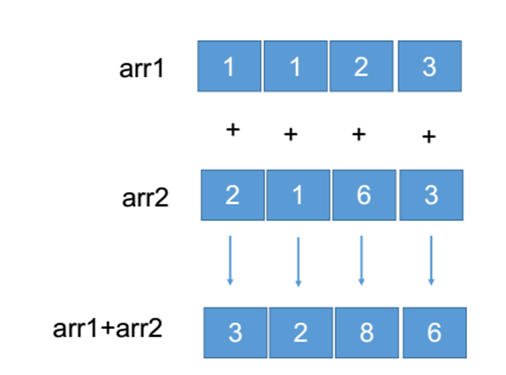

## 五 矩阵的乘法
矩阵积(`matrix product`)：两个二维矩阵(行和列的矩阵)满足第一个矩阵的列数与
第二个矩阵的行数相同，那么可以进行矩阵的乘法，即矩阵积，
矩阵积不是元素级的运算。也称为点积、数量积
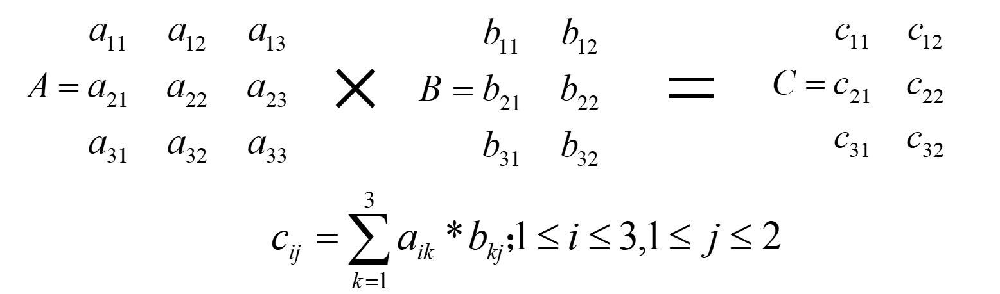

**numpy提供了矩阵乘法的函数`dot`**
```python
import numpy as np

arr1 = np.arange(1, 7).reshape(2,3)
arr2 = np.arange(11, 17).reshape(3,2)
arr = arr1.dot(arr2)  # ndarray对象的dot方法
print(arr)
np.dot(arr1, arr2)  # np的dot函数
```

## 六 数组转置
* 数组转置是指将`shape`进行重置操作，并将其值重置为原始`shape`元组的倒置，
  比如原始的`shape`值为:`(2,3,4)`，
  那么转置后的新元组的`shape`的值为: `(4,3,2)`
* 对于二维数组而言(矩阵)数组的转置其实就是**矩阵的转置**
* 可以通过调用数组的`transpose`函数或者`T`属性进行数组转置操作

```python
import numpy as np

arr1 = np.arange(1, 7).reshape(2,3)
print(arr1)  # 原数组
print(arr1.T)  # 转置后的数组
print(arr1.transpose())  # 转置后的数组
```

## 七 ndarray常用数学函数
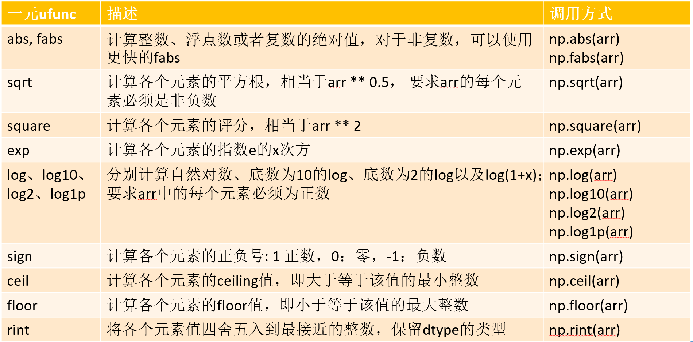
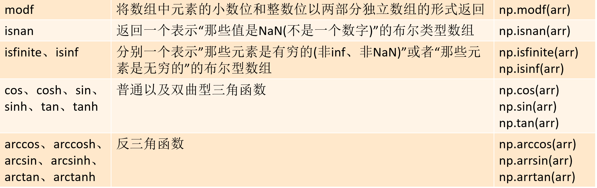
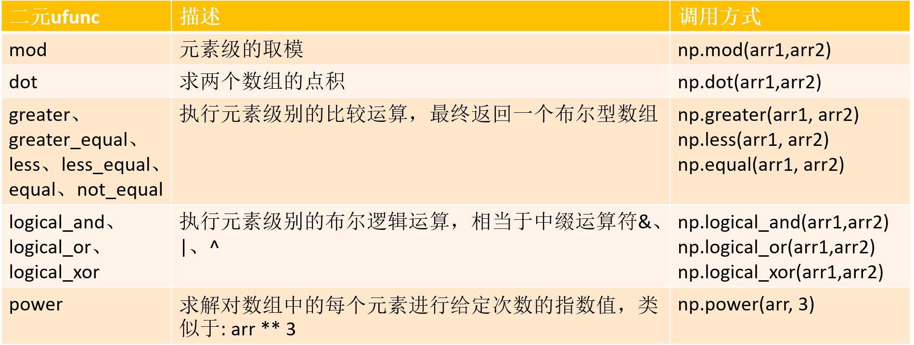

## 八 numpy文件存取
### 8.1 文件存取(`numpy.savetxt`和`numpy.loadtxt`)
* `numpy.savetxt(frame, array. fmt,delimiter)`: 保存数据
  * frame: 文件对象或字符串(文件路径)
  * array: 待保存数据
  * fmt: 保存数据格式
  * delimiter: 数据间的分隔符
  
* `numpy.loadtxt(frame, dtype, delimiter, usecols, unpack,converters)`
  * frame: 文件对象或字符串(文件路径)
  * dtype: 元素数据类型
  * delimiter: 分隔符
  * usecols: 要读取的列
  * unpack: 是否按列拆包
  * converters: 转换函数字典

**示例**
```
np.loadtxt(
    '../aapl.csv',			# 文件路径
    delimiter=',',			# 分隔符
    usecols=(1, 3),			# 读取1、3两列 （下标从0开始）
    unpack=False,			# 是否按列拆包
    dtype='U10, f8',		# 制定返回每一列数组中元素的类型
    converters={1:func}		# 转换器函数字典
) 
```
以上两个函数只能对一维和二维数组进行存储和读取，对于更高维数组没有办法进行操作
### 8.2 任意维度数组的存取(numpy.tofile和numpy.fromfile)
* `numpy.tofile(frame, sep, fmt)`: 保存数据
  * frame: 文件对象或字符串(文件路径)
  * fmt: 保存数据格式
  * sep: 分隔符
  
* `numpy.fromfile(frame, dtype,count=-1, sep=" ")`: 读取数据
  * frame: 文件对象或字符串(文件路径)
  * dtype: 元素数据类型
  * count: 读取数据个数, -1表示读取整个文件
  * sep: 分隔符
  
### 8.3 numpy便捷文件存取
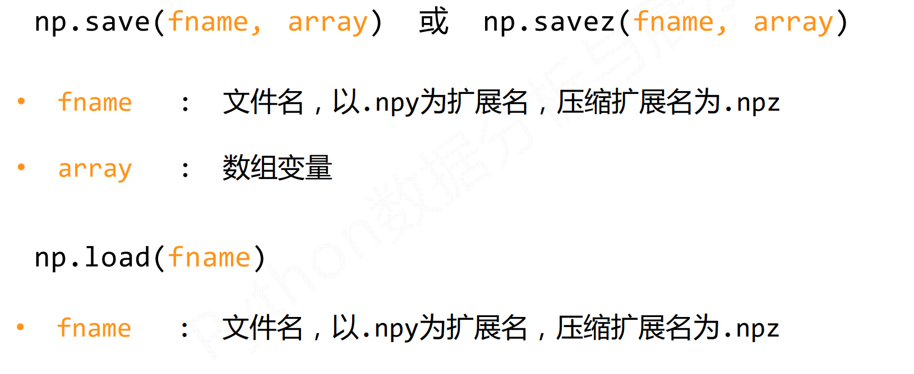

## 九 随机函数
numpy提供随机函数在random子库中

常用随机函数有
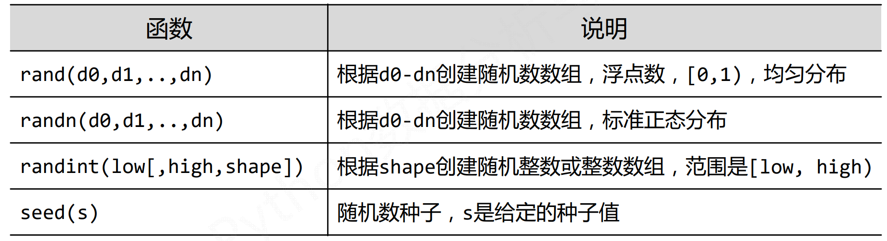
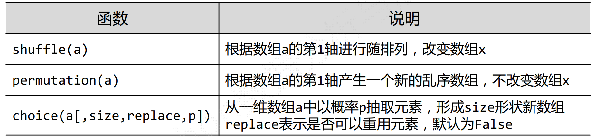
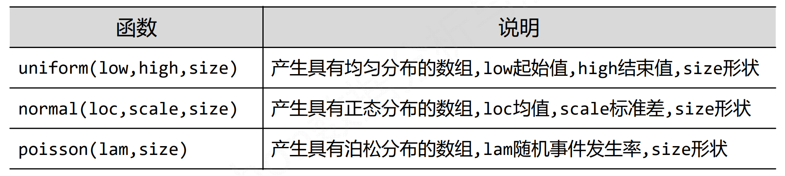

## 十 统计函数
numpy提供的统计函数在主库之下，只需要通过numpy就可以调用例如`numpy.var()``
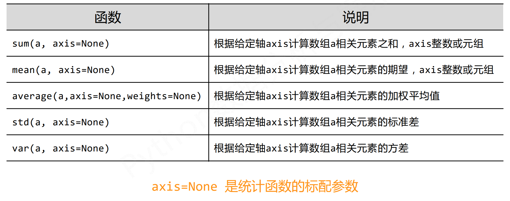
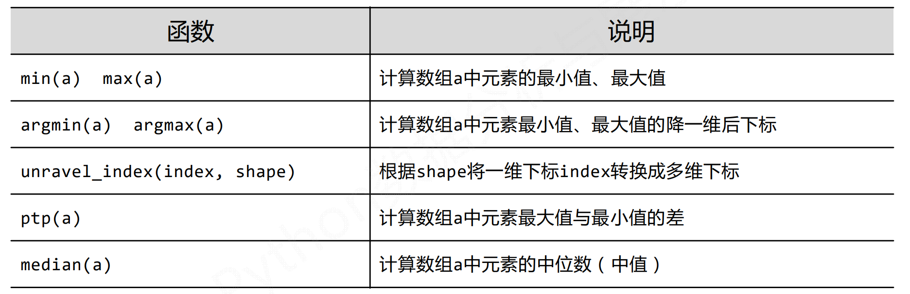

## 十一 梯度
numpy直接提供了求梯度的函数
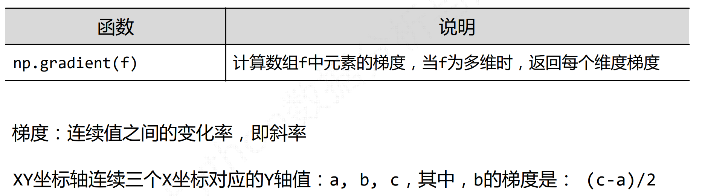


## 十二 where和unique
* `numpy.where(条件, 数组1, 数组2)`: 是三目运算符的矢量表达式
* `numoy.unique(数组)`或`ndarray.unique()`: 去重


