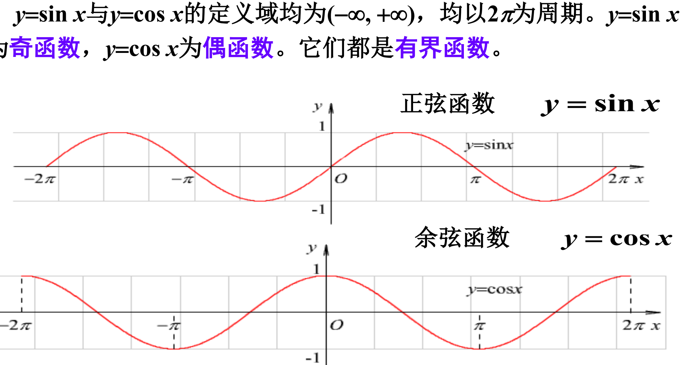
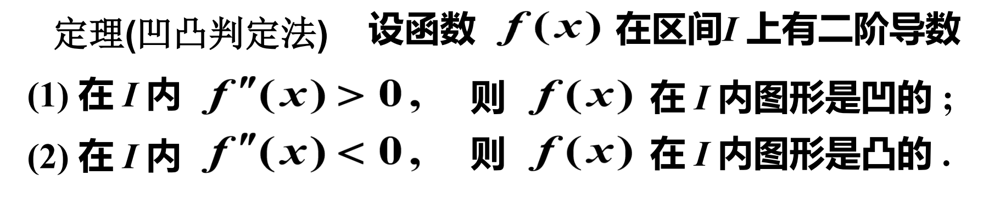
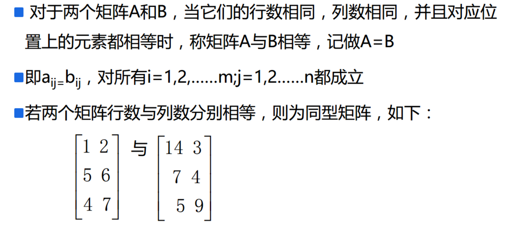
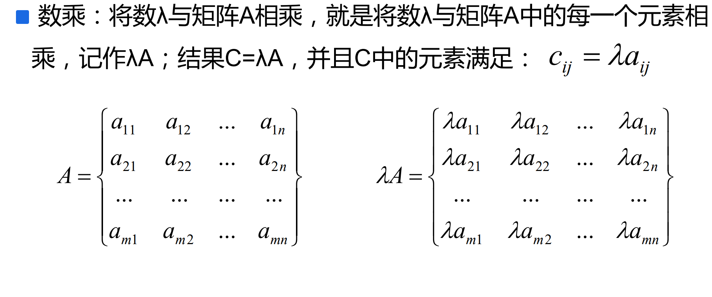
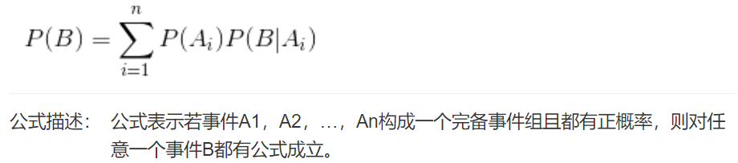
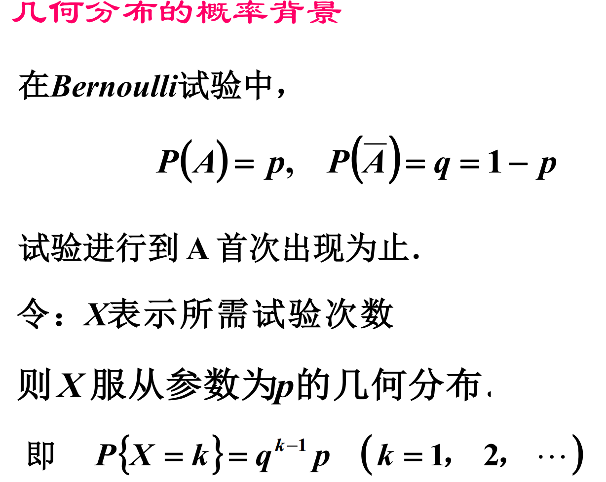

# 一 数据分析

## 1 函数

给定一个数集$A$，对$A$施加一个对应的法则/映射$f$，记做:$f(A)$，那么可以得到另外一个数集$B$，也就是可以认为$B=f(A)$；那么这个关系就叫做函数关系式，简称函数。三个重要的因素: $定义域A、值域B、
对应的映射法则f$

**常见函数**

**反函数**

若函数$f:D\rightarrow f(D)$ ,它存在逆映射 $f^{－1}:f(D) \rightarrow D$，则此映射$ f^{－1}$ 
称为函数 $f$ 的反函数.

**反函数性质**

**复合函数**

设函数 $y = f (u)$ 的定义域为$D1$ , 函数 $u = g(x)$在 $D$上有定义，且 $g(D)\rightarrow D1$，则函数$ y = f[g(x)], \forall x \in D$ 称为由函数 $u = g(x)$ 和函数 $y =f (u)$ 构成的复 合函数，其定义域为$D$，变量 $u$ 称为中间变量. 函数$f$ 和 $g$ 构成的复合函 数通常记为 $f ◦ g$，即 $( f ◦ g )(x) = f [ g(x)]$ .

## 2 基本初等函数

**幂函数**

**指数函数**

**对数函数**

**三角函数**

> 正弦函数与余弦函数

> 正切函数与余切函数

> 正割与余割

**反三角函数**

> 反正弦函数

> 反余弦函数

> 反正切函数

> 反余切函数

## 3 极限

**数列极限**

**收敛数列的性质**

* 若数列${ x_n }$收敛，则它的极限唯一 .
* 若数列${x_n}$收敛，则数列${x_n }$一定有界
* 

**函数极限**

**左极限与右极限**

**函数极限2**

**左极限与右极限2**

**函数极限性质**

* 函数极限唯一性

* 函数极限的局部有界性

  

* 函数极限的局部保号性

  

**极限存在的条件**

**两个重要极限1**

**两个重要极限2**

## 4 导数

**导数的定义**

**基本求导公式**

**和差积商的求导规则**

**复合函数求导**

**高阶导数**

**函数单调性判断**

**曲线的凹凸性**

> 凹凸性判断
>
> 

**极值点定义**

**极值点的判断**

**极值存在的第一充分条件**

**极值存在的第二充分条件**

**函数的最值**

> 

## 4 泰勒公式

**泰勒公式余项**

**常见函数的泰勒展开式**

## 5 多元函数

**二元函数定义**

当$n\ge 2$时，$n$元函数统称为多元函数.多元函数中同样有定义域、值域、自变量、 因变量等概念

**二元函数的极限(重极限)**

**累次极限**

**重极限与累次极限关系**

**二元函数偏导数**

**偏导数推广**

**高阶偏导数**

**方向导数**

**可微函数的方向导数**

**二元函数的方向导数**

## 6 梯度

**梯度定义**

# 二 线性代数

**线性与线性代数**

## 1 向量

**向量的定义**

**向量的运算**

**正交向量**

## 2 矩阵

**矩阵定义**

**矩阵的表示**

**矩阵与向量**

**矩阵相等**

**方阵**

**特殊矩阵**

**对角矩阵**

**单位矩阵**

**零矩阵**

**矩阵加法运算**

**矩阵的数乘**

**矩阵与向量的乘法**

**矩阵与矩阵的乘法**

**矩阵转置**

## 3 行列式

**行列式**

**代数余子式**

**伴随矩阵**

**方阵的逆**

**矩阵运算定律**

**矩阵的初变换**

**等价矩阵**

**阶梯矩阵**

**矩阵的标准形**

**k阶子式**

**矩阵的秩**

**矩阵秩的求法**

## 4. 向量组

**向量组等价**

**系数矩阵**

**正交矩阵**

**对称矩阵**

## 5 线性方程组

**线性方程组有解的条件**

**求解线性方程组**

**齐次线性方程组有解的条件**

**非齐次线性方程组有解的条件**

**齐次线性方程组的基础解系**

**齐次线性方程组解的结构**

**非齐次线性方程组解的结构**

## 6 特征值和特征向量

**特征值性质**

## 7 特征值性质

**矩阵对角化判断**

**正定矩阵**

**奇异矩阵与非奇异矩阵**

**QR分解**

* **方法一**

  

* **方法二**

  

  **示例**

  

* **方法三**

  

  

**奇异值分解**

## 8 向量导数

**标量对向量的导数**

**标量对方阵的导数**

# 三 概率

## 1 排列数与组合数

## 2 古典概率模型

## 3 概率律

**概率律的性质**

## 4 条件概率

**条件概率律**

### 4.1 全概率公式

### 4.2 贝叶斯公式

### 4.3 先验概率与后验概率

**条件概率公式总结**

### 4.4 独立性

## 5 随机变量及其分布律

### 5.1 离散型随机变量及其分布律

#### 5.1.1 离散型随机变量的定义

#### 5.1.2 离散型随机变量的分布列

#### 5.1.3 离散型随机变量分布律的性质

## 5.2 常用的离散型随机变量

### 5.2.1 伯努利分布

**Bernoulli分布也称作 0-1 分布或二点分布．**

### 5.2.2 二项分布

### 5.2.3 泊松分布

**泊松定理**

> **泊松定理应用**

### 5.2.4 几何分布

### 5.2.5 超几何分布

## 5.3 连续型随机变量及其概率密度

### 补充 不定积分

**不定积分的性质**

**求导与积分**

### 定积分

### 5.3.1 连续型随机变量的概念与性质

### 5.3.2 概率密度 f(x) 的性质

**连续型随机变量的概率**

### 5.4 常用的连续型随机变量

### 5.4.1 均匀分布

### 5.4.2 指数分布

### 5.4.3 正态分布

****

**标准正态分布的计算**

****

**一般正态分布的计算**

### 5.4.4 伽马分布

**伽马函数**

**伽马分布**

## 6 数字特征

### 6.1 期望

**期望的性质**

### 6.2 方差

**方差性质**

**常见分布的期望与方差**

### 6.3 标准差

### 6.4 协方差

**协方差性质**

**协方差矩阵**

### 6.5 相关系数

## 6.6 中心矩、原点矩

### 6.7 峰度

### 6.8 偏度

### 6.9 切比雪夫不等式

### 6.10 大数定律

### 6.11 中心极限定理

## 7 参数估计

### 7.1 点估计

## 7.2 矩估计

## 7.3 极大似然估计

### 7.3.1 离散型参数极大似然估计

### 7.3.2 连续型参数极大似然估计

