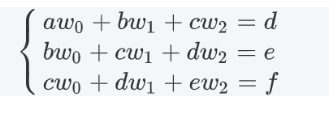
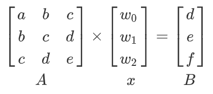
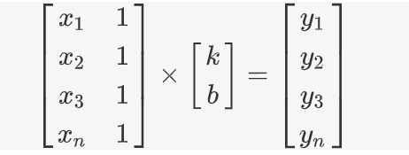
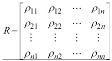

# 一 线性模型

线形关系是**指两个变量之间存在一次函数关系**。函数表达式为: 
$y=k_1x_1+k_2x_2+\cdots+k_nx_n$，其中$k_i(i=1,2,...)$为常熟数。

如果表达式为$y=k_1x_1+k_2x_2+\cdots+k_nx_n+c$, 其中$c$为常数项，这样的关系
称为直线关系，而不是线性关系。

**线性关系主要特征就是经过坐标原点**

## 1.1 线性关系的向量表达式
给定向量组$A$: $\vec{\alpha_1},\vec {\alpha_2}, \cdots,\vec{\alpha_n}$，以及向量$b$，
若存在一组常数数$k_1，k_2, \cdots, k_n$，使得

$$
\vec{b} = \sum_i^n k_i\vec{\alpha_i}=k_1\vec{\alpha_1} + k_2\vec{\alpha_2} + \cdots + k_n\vec{\alpha_n}
$$

则称向量$\vec{b}$可由向量组$A$线性表示，也称向量$\vec{b}$是向量组$A$的一个线性组合，
$k_1，k_2, \cdots, k_n$,称为这个线性组合的系数

向量$\vec{b}$可由向量组$A$线性表示，也就是线性方程组

$$
k_1\vec{\alpha_1} + k_2\vec{\alpha_2} + \cdots + k_n\vec{\alpha_n} = \vec{b}
$$
有解

设有向量组$A$:  $\vec{\alpha_1},\vec {\alpha_2}, \cdots,\vec{\alpha_n}$，和$B$：$\vec{\beta_1},\vec{\beta_2}, \cdots, \vec{\beta_n}$,
若向量组B中的每一个向量都可由向量组A线性表示，则称向量组B可由向量组A线性表示；
如果向量组A和向量组B能互相线性表示，则称这两个向量组等价，记作$A≌B$

## 1.2 线性预测

假设一组数据符合一种线型规律，那么就可以预测未来将会出现的数据。
已知数据$a,b,c,d,e,f$，假设满足如下线性关系



转为矩阵表示如下




**numpy提供了解线性方程组的方法**
```python
import numpy as np
A = []  # 方程组的系数矩阵
B = []  # 常数项
x = np.linalg.lstsq(A, B)[0]
```

通过解线性方差组获得系数值，预测之后出现的值。

**案例，预测股票未来价格(无效)**
```python
import numpy as np
from datetime import datetime


# 日期转换函数
def dmy2ymd(dmy):
    # 将日-月-年 转为 年-月-日
    dmy = str(dmy, encoding='utf-8')
    time = datetime.strptime(dmy, '%d-%m-%Y').date()
    t = time.strftime('%Y-%m-%d')
    return t


dates, closing_prices = np.loadtxt('./data/aapl.csv',  # 读取文件
                                   delimiter=',',  # 分隔符
                                   usecols=(1, 3, 4, 5, 6),  # 要读取的列
                                   dtype='M8[D], f8, f8, f8, f8',  # 每个维度的数据类型
                                   unpack=True,  # 拆包
                                   converters={1: dmy2ymd}  # 自定第几列使用的转换函数
                                   )

N = 5
pred_prices = np.zeros(closing_prices.size - 2 * N + 1)
for i in range(pred_prices.size):
    a = np.zeros((N, N))
    for j in range(N):
        a[j,] = closing_prices[i + j:i + j + N]
    b = closing_prices[i + N:i + N * 2]
    x = np.linalg.lstsq(a, b)[0]
    pred_prices[i] = b.dot(x)

print(pred_prices)
```

## 1.2 线性拟合

线性拟合是曲线拟合的一种形式。

设$x$和$y$都是被观测的量，且$y$是$x$的函数: $y=f(x, b)$，曲线拟合就是通过$x,y$
的观测值来寻求参数$b$的最佳估计值，及寻求最佳的理论曲线$y=f(x; b)$。
当函数$y=f(x; b)$为关于$b$的线性函数时，称这种曲线拟合为线性拟合

已知点$(x_i, y_i)$, 代入线性方程$y=kx+b$，得如下方差组。
，解线性方程的最小二乘解
```python
import numpy as np
A = []  # 方程组的系数矩阵
B = []  # 常数项
x = np.linalg.lstsq(A, B)
```
* 该方法是通过最小二乘法求出所有结果中拟合误差最小的$k$与$b$的值

**案例，线性拟合绘制股票的趋势线**
```python
import numpy as np
from datetime import datetime
import matplotlib.pyplot as plt
# 日期转换函数
def dmy2ymd(dmy):
    # 将日-月-年 转为 年-月-日
	dmy = str(dmy, encoding='utf-8')
	time = datetime.strptime(dmy, '%d-%m-%Y').date()
	t = time.strftime('%Y-%m-%d')
	return t

dates, opening_prices,highest_prices, \
	lowest_prices, closing_prices  = np.loadtxt('./data/aapl.csv',  # 读取文件
                  delimiter=',',  # 分隔符
                  usecols=(1, 3, 4, 5, 6),  # 要读取的列
                  dtype='M8[D], f8, f8, f8, f8',  # 每个维度的数据类型
                  unpack=True,  # 拆包
                  converters={1: dmy2ymd}  # 自定第几列使用的转换函数
                  )
# 计算趋势价格，最高 最低 收盘 的平均值
trend_points = (highest_prices + lowest_prices + closing_prices) / 3

plt.scatter(dates, trend_points, marker='o')

# 绘制趋势线
days = dates.astype('int32')
A = np.ones((30, 2))
A[:,0] = dates
B = trend_points

k, b = np.linalg.lstsq(A, B)[0]

trend_line = k * days + b
plt.plot(days, trend_line)

plt.show()
```

# 二 协方差 相关矩阵 相关系数

## 2.1 协方差
评估这两组统计数据的相似程度。协方差用于衡量两个变量的总体误差，计算公式如下


给定两个样本A: $[a_1, a_2, ..., a_n]$, B: $[b_1, b_2, ..., b_n]$
计算这两组样本的协方差：
* 计算均值: 样本A的均值: $\overline a$; 样本B的均值: $\overline b$
* 计算离差: 样本A的离差: $dev_a$, 样本B的离差: $dev_b$
* 计算协方差: $cov_ab = \ave(dev_a \times dev_b)$或$cov_ba = \ave(dev_b \times dev_a)$
    * 样本A与样本B的协方差: 样本A的离差 与 样本B的离差的积 求和在的求均值
    
**样本**
```
A = [a1, a2, ..., an]
B = [b1, b2, ..., bn]
```
**均值**
```
ave_a = (a1 + a2 +...+ an)/n
ave_b = (b1 + b2 +...+ bn)/n
```
**离差**
```
dev_a = [a1, a2, ..., an] - ave_a
dev_b = [b1, b2, ..., bn] - ave_b
```
**协方差**
```
cov_ab = ave(dev_a x dev_b)
cov_ba = ave(dev_b x dev_a)
```


**案例，计算两组数据的协方差**
```python
import numpy as np
import matplotlib.pyplot as plt

a = np.random.randint(1, 30, 10)
b = np.random.randint(1, 30, 10)
#平均值
ave_a = np.mean(a)
ave_b = np.mean(b)
#离差
dev_a = a - ave_a
dev_b = b - ave_b
#协方差
cov_ab = np.mean(dev_a*dev_b)
cov_ba = np.mean(dev_b*dev_a)

print('a与b数组：', a, b)
print('a与b样本方差：', np.sum(dev_a**2)/(len(dev_a)-1), np.sum(dev_b**2)/(len(dev_b)-1))
print('a与b协方差：',cov_ab, cov_ba)
#绘图，查看两条图线的相关性
plt.figure('COV LINES', facecolor='lightgray')
plt.title('COV LINES', fontsize=16)
plt.xlabel('x', fontsize=14)
plt.ylabel('y', fontsize=14)
x = np.arange(0, 10)
#a,b两条线
plt.plot(x, a, color='dodgerblue', label='Line1')
plt.plot(x, b, color='limegreen', label='Line2')
#a,b两条线的平均线
plt.plot([0, 9], [ave_a, ave_a], color='dodgerblue', linestyle='--', alpha=0.7, linewidth=3)
plt.plot([0, 9], [ave_b, ave_b], color='limegreen', linestyle='--', alpha=0.7, linewidth=3)

plt.grid(linestyle='--', alpha=0.5)
plt.legend()
plt.tight_layout()
plt.show()
```

## 2.2 相关系数
协方差作为描述X和Y相关程度的量，在同一物理量纲之下有一定的作用，但同样的两个量采用不同的量纲使它们的协方差在数值上表现出很大的差异。
为此引入如下概念： 定义 

称为随机变量X和Y的(Pearson)相关系数。

* 若相关系数越接近于0，越表示两组样本越不相关。
* 若相关系数越接近于1，越表示两组样本正相关。
* 若相关系数越接近于-1，越表示两组样本负相关。


## 2.3 相关矩阵
设$(X_1,X_2,X_3, ..., X_n)$是一个n维随机变量,任意$X_i$与$X_j$的相关系数$ρ_{ij}$
（i,j=1,2,...n）存在,则以$ρ_{ij}$为元素的$n$阶矩阵称为该维随机向量的相关矩阵.记作$R$,
即


**numpy提供求相关矩阵的api**
```python
import numpy
# 相关矩阵
numpy.corrcoef(a, b)	
# 相关矩阵的分子矩阵    协方差矩阵
# [[a方差，ab协方差], [ba协方差, b方差]]
numpy.cov(a, b)
```

