# 机器学习概述

## 一 机器学习的定义

机器学习是一门多学科交叉专业，涵盖概率论知识，统计学知识，
近似理论知识和复杂算法知识，使用计算机作为工具并致力于真实实时的模拟人类学习方式，
并将现有内容进行知识结构划分来有效提高学习效率。  

机器学习有下面几种定义：
1. 机器学习是一门人工智能的科学，该领域的主要研究对象是人工智能，特别是如何在经验学习中改善具体算法的性能。
2. 机器学习是对能通过经验自动改进的计算机算法的研究。
3. 机器学习是用数据或以往的经验，以此优化计算机程序的性能标准。

**机器学习直白来讲，是根据已有的数据，进行算法选择，并基于算法和数据构建模型,
最终对未来进行预测**

## 二 机器学习的理性认识
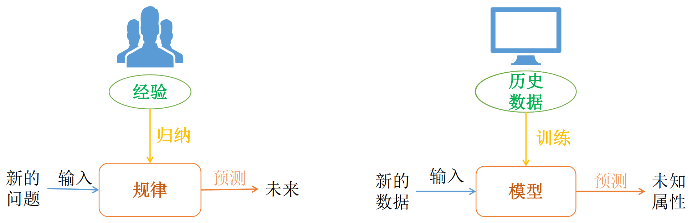

* 输入: $x \in \chi$(属性值)
* 输出: $y \in Y$(目标值)
* 获得目标函数
    * $f: \chi \rightarrow Y$(最理想的映射关系, 最理想的函数)
* 输入数据: $D=\{(x_1,y_1),(x_2,y_2),\cdots,(x_ny_n)\}$(历史记录的数据信息)
* 最终具有最优性能的假设公式:
    * $g:\chi \rightarrow Y$(学习得到的公式)
  
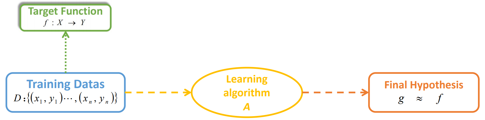
* 目标函数$f$无法得到
* 假设函数$g$与$f$类似，可能不同

**机器学习无法得到一个完美的函数$f$**

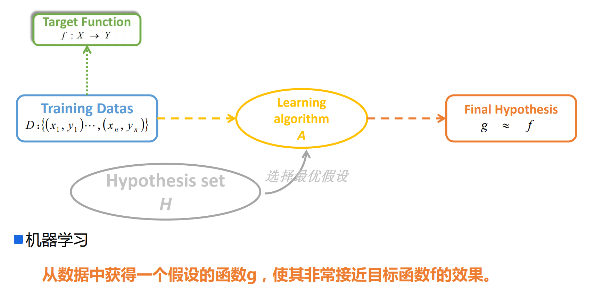

## 三 机器学习的概念
美国卡内基梅隆大学（`Carnegie Mellon University`）机器学习研究领域的著名教授Tom
`Mitchell`对机器学习的经典定义如下：

对于某给定的**任务T**，在合理的**性能度量方案P**的前提下，
某计算机程序可以**自主学习任务T的经验E**；随着提供合适、优质、大量的经验E，
该程序对于任务T的性能逐步提高。
* 其中重要的机器学习对象：
  * 任务Task T，一个或多个、经验Experience E、度量性能Performance P
  * 即：随着任务的不断执行，经验的累积会带来计算机性能的提升。

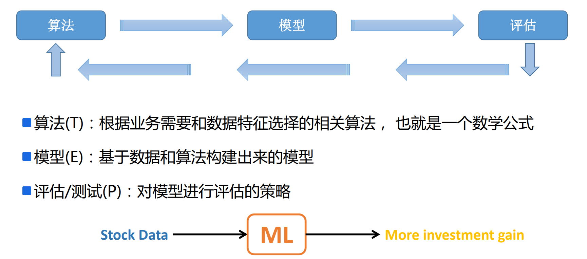

**机器学习的相关概念**
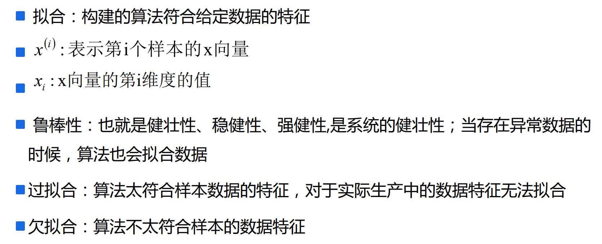

## 四 机器学习、数据分析、数据挖掘区别与联系
* 数据分析：数据分析是指用适当的统计分析方法对收集的大量数据进行分析，并
提取有用的信息，以及形成结论，从而对数据进行详细的研究和概括过程。在实
际工作中，数据分析可帮助人们做出判断；数据分析一般而言可以分为统计分析、
探索性数据分析和验证性数据分析三大类。
* 数据挖掘：一般指从大量的数据中通过算法搜索隐藏于其中的信息的过程。通常
通过统计、检索、机器学习、模式匹配等诸多方法来实现这个过程。
* 机器学习：是数据分析和数据挖掘的一种比较常用、比较好的手段。

## 五 机器学习分类
* 有监督学习
  * 用已知某种或某些特性的样本作为训练集，以建立一个数学模型，再用已建立的模型来预
  测未知样本，此种方法被称为有监督学习，是最常用的一种机器学习方法。是从标签化训
  练数据集中推断出模型的机器学习任务。
* 无监督学习
  * 与监督学习相比，无监督学习的训练集中没有人为的标注的结果，在非监督的学习过程中，
  数据并不被特别标识，学习模型是为了推断出数据的一些内在结构。
* 半监督学习
  * 考虑如何利用少量的标注样本和大量的未标注样本进行训练和分类的问题，是有监督学习
  和无监督学习的结合

### 5.1 有监督学习算法
有监督学习算法分为**判别式模型和生成式模型**

* **判别式模型(Discriminative Model)**：直接对条件概率$p(y|x)$进行建模，
  常见判别模型有：线性回归、决策树、支持向量机SVM、k近邻、神经网络等；
* **生成式模型(`Generative Model`)**：对联合分布概率$p(x,y)$进行建模，
  常见生成式模型有：隐马尔可夫模型`HMM`、朴素贝叶斯模型、高斯混合模型`GMM`、`LDA`等；

**两种模型比较**
* 生成式模型**更普适**；
* 判别式模型**更直接，目标性更强**
* 生成式模型**关注数据是如何产生的，寻找的是数据分布模型**；
* 判别式模型**关注的数据的**

**差异性，寻找的是分类面**
* 生成式模型可以产生判别式模型
* 判别式模式没法形成生成式模型

### 5.2 无监督学习
无监督学习试图学习或者提取数据背后的数据特征，或者从数据中抽取出重要的
特征信息，常见的算法有聚类、降维、文本处理(特征抽取)等。

**无监督学习一般是作为有监督学习的前期数据处理**，功能是从原始数据中抽取出
必要的标签信息。

### 5.3 半监督学习(SSL)
主要考虑如何利用少量的标注样本和大量的未标注样本进行训练和分类的问题。
半监督学习对于**减少标注代价**，提高学习机器性能具有非常重大的实际意义。

SSL的成立依赖于模型假设，主要分为三大类：平滑假设、聚类假设、流行假设；
其中流行假设更具有普片性。

SSL类型的算法主要分为四大类：半监督分类、半监督回归、半监督聚类、半监
督降维。

缺点：**抗干扰能力弱**，仅适合于实验室环境，其现实意义还没有体现出来；未来
的发展主要是聚焦于新模型假设的产生。

* 分类
  * 通过分类模型，将样本数据集中的样本映射到某个给定的类别中
* 聚类
  * 通过聚类模型，将样本数据集中的样本分为几个类别，属于同一类别的样本相似性比较大 
* 回归
  * 反映了样本数据集中样本的属性值的特性，通过函数表达样本映射的关系来发现属性值之间的依 
    赖关系
* 关联规则
  * 获取隐藏在数据项之间的关联或相互关系，即可以根据一个数据项的出现推导出其他数据项的出 
    现频率。

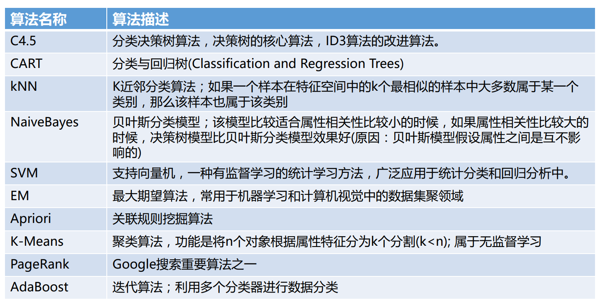

## 六 机器学习、人工智能和深度学习的关系
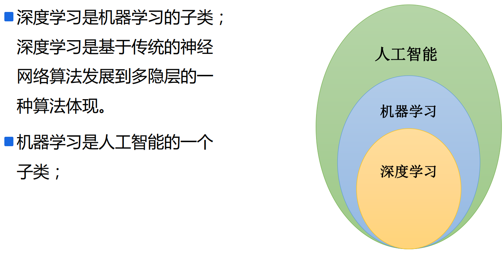

## 七 机器学习开发流程
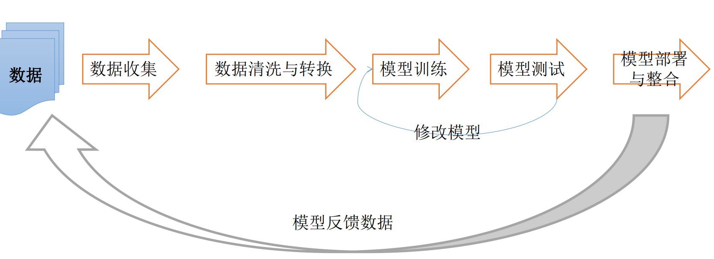

* 数据收集与存储
  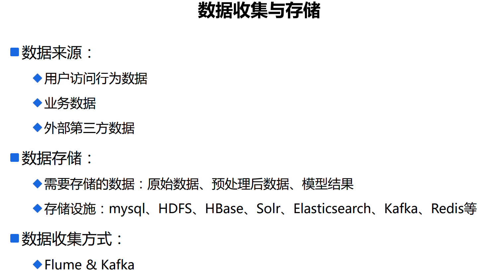
  * 开源数据集
    
    在实际工作中，我们可以使用业务数据进行机器学习开发，但是在学习过程中，
    没有业务数据，此时可以使用公开的数据集进行开发，常用数据集如下：
    * http://archive.ics.uci.edu/ml/datasets.html
    * https://aws.amazon.com/cn/public-datasets/
    * https://www.kaggle.com/competitions
    * http://www.kdnuggets.com/datasets/index.html
    * http://www.sogou.com/labs/resource/list_pingce.php
    * https://tianchi.aliyun.com/datalab/index.htm
    * http://www.pkbigdata.com/common/cmptIndex.html

## 八 模型评估
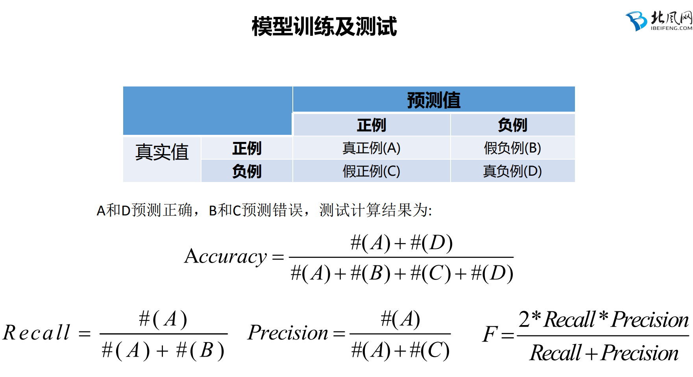
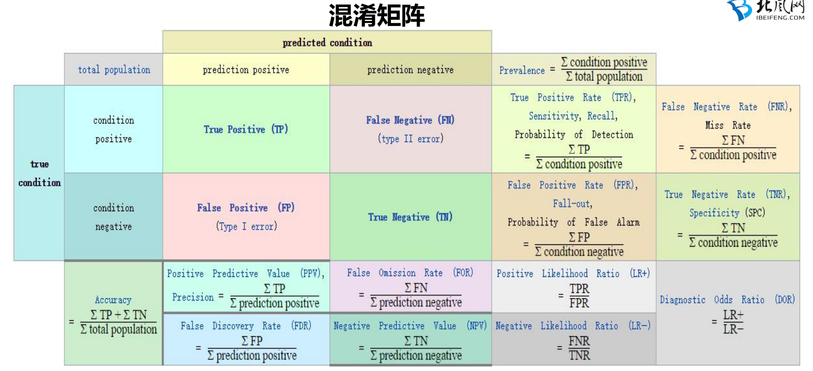
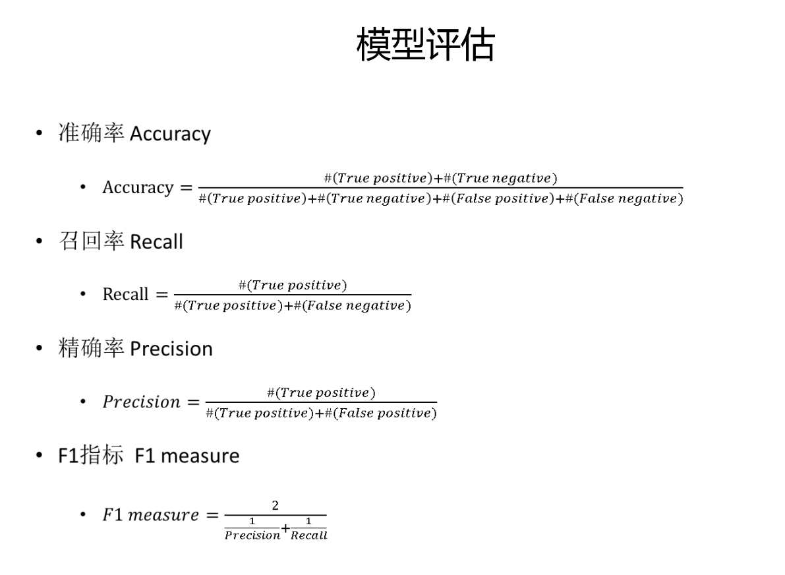

### 8.1 ROC
`ROC（Receiver Operating Characteristic）`最初源于20世纪70年代的信号
检测理论，描述的是分类混淆矩阵中`FPR-TPR`两个量之间的相对变化情况，
ROC曲线的纵轴是“真正例率”（`True Positive Rate` 简称`TPR`），横轴是“假
正例率” （`False Positive Rate` 简称`FPR`）。

如果二元分类器输出的是对正样本的一个分类概率值，当取不同阈值时会
得到不同的混淆矩阵，对应于`ROC`曲线上的一个点。那么`ROC`曲线就反映了
`FPR`与`TPR`之间权衡的情况，通俗地来说，即在`TPR`随着`FPR`递增的情况下，谁
增长得更快，快多少的问题。`TPR`增长得越快，曲线越往上屈，`AUC`就越大，
反映了模型的分类性能就越好。当正负样本不平衡时，这种模型评价方式比起
一般的精确度评价方式的好处尤其显著
### 8.2 AUC
AUC的值越大表达模型越好

AUC（Area Under Curve）被定义为ROC曲线下的面积，显然这个
面积的数值不会大于1。又由于ROC曲线一般都处于y=x这条直线的
上方，所以AUC的取值范围在0.5和1之间。使用AUC值作为评价标准
是因为很多时候ROC曲线并不能清晰的说明哪个分类器的效果更好，
而AUC作为数值可以直观的评价分类器的好坏，值越大越好。
AUC = 1，是完美分类器，采用这个预测模型时，不管设定什么阈值
都能得出完美预测。绝大多数预测的场合，不存在完美分类器。
0.5 < AUC < 1，优于随机猜测。这个分类器（模型）妥善设定阈值
的话，能有预测价值。
AUC = 0.5，跟随机猜测一样（例：丢铜板），模型没有预测价值。
AUC < 0.5，比随机猜测还差；但只要总是反预测而行，就优于随机
猜测。

