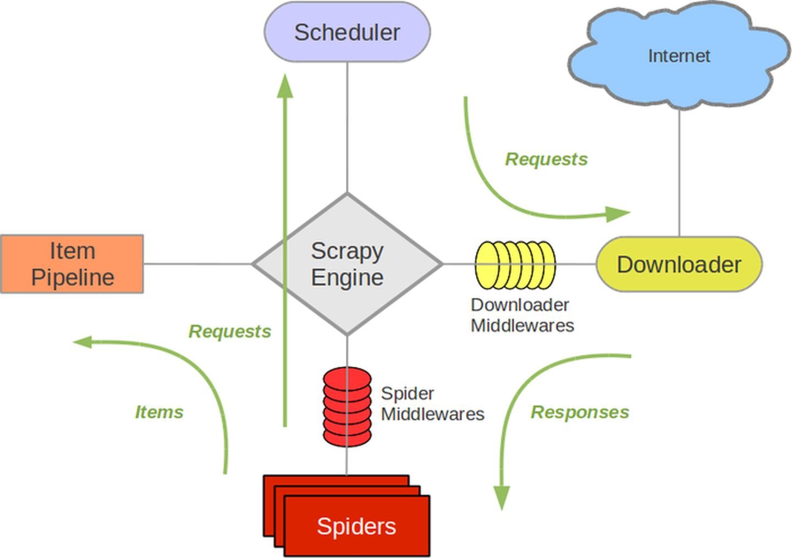

# 一、scrapy框架初识

- 什么是框架？
    - 就是一个具有很强通用性且集成了很多功能的项目模板（可以被应用在各种需求中）
- scrapy集成好的功能：
    - 高性能的数据解析操作（xpath）
    - 高性能的数据下载
    - 高性能的持久化存储
    - 中间件
    - 全栈数据爬取操作
    - 分布式：redis
    - 请求传参的机制（深度爬取）
    - scrapy中合理的应用selenium

- 环境的安装
    * `pip3 install wheel`

    * 下载`twisted`:chttp://www.lfd.uci.edu/~gohlke/pythonlibs/#twisted

    * 进入下载目录，执行 `pip3 install Twisted‑17.1.0‑cp35‑cp35m‑win_amd64.whl`

    * `pip3 install pywin32`

    * `pip3 install scrapy`

****

# 二、基本使用

## 2.1 创建工程

- `scrapy startproject ProName`: 创建项目
- `cd ProName`: 进入项目目录
- `scrapy genspider spiderName www.xxx.com`: 创建爬虫文件
- 编写代码
- `scrapy crawl spiderName`: 执行
- `settings`:
    - 不遵从`robots`协议: `settings.py`中修改`ROBOTSTXT_OBEY = False`
    - `UA`伪装: `settings.py`中修改`USER_AGENT`
    - `LOG_LEVEL = 'ERROR'`: 日志等级
    - `LOG_FILE = 'file.log'`: 日志保存位置

## 2.2 目录结构


**first.py**: 爬虫文件

```python
import scrapy


class FirstSpider(scrapy.Spider):
    name = 'first'  # 爬虫文件的名称, 爬虫源文件的唯一标识
    # allowed_domains = ['www.baidu.com', 'www.sogo.com']  # 允许的域名, 通常进行注释
    start_urls = ['https://dig.chouti.com/']  # 起始的url列表, scrapy会自动的获取url发起请求

    # 解析响应数据
    def parse(self, response):
        pass
```

* `name`: 爬虫文件的名称, 爬虫源文件的唯一标识
* `allowed_domains`: 允许爬取的域名，通常不使用
* `start_urls`: 爬虫起始url
* `parse`: 解析数据方法

`scrapy`会使用`start_urls`中的url自动发起请求，将响应保存在`response`中。

## 2.3 数据解析

`scrapy`解析数据是基于`xpath`进行数据解析。将`xpath`封装到了`response`对象中。

```
response.xpath("xpath表达式")
```

该方法返回的是一个`Selector`对象列表， 想要获得数据需要调用`Selector`对象的`extract()`方法

**作用在`Selector`对象列表上的解析方法**

* `Selector对象列表.extract()`: 获取列表中所有`selector`对象保存的数据
* `Selector对象列表.extract_first()`:  获取列表中第一个`selector`对象保存的数据

## 2.4 数据存储

`scrapy`保存数据有两种方法，一种是**基于终端指令方式**，一种是**基于管道方式**

### 2.4.1 基于终端指令的存储方式

在爬虫文件中编写如下代码，`parse`方法返回值要是一个`key-value`**键值**或`key-vaue`
**嵌套在可迭代对象中**，

```python
import scrapy


class FirstSpider(scrapy.Spider):
    name = 'first'  # 爬虫文件的名称, 爬虫源文件的唯一标识
    # allowed_domains = ['www.baidu.com', 'www.sogo.com']  # 允许的域名, 通常进行注释
    start_urls = ['https://dig.chouti.com/']  # 起始的url列表, scrapy会自动的获取url发起请求

    # 解析响应数据
    def parse(self, response):
        content = []

        div_list = response.xpath('/html/body/main/div/div/div[1]/div/div[2]/div[1]/div')
        for div in div_list:
            title = div.xpath('./div/div/div/a/text()').extract_first()
            content.append({"title": title})

        return content
```

当执行爬虫文件时指定数据保存文件: `scrapy crawl first -o file.csv`

基于终端指令的存储方式存在较大的局限性，

* **只可以将`parse`方法的返回值存储到磁盘文件中**
* 文件的后缀只能是`.csv .xsl .json`等文件，不能写入数据库

### 2.4.2 基于管道方式的数据存储

创建`scrapy`项目时，自动为我们创建了一个`pipelines.py`的文件，该文件时用于编写 数据存储管道的文件。

**使用`pipelines.py`的流程如下**

- 编码流程：
    1. 数据解析
    2. 在`item`的类中定义相关的属性: 创建项目时生成了`items.py`，该文件用于定义和保存存储数据的中间者`item`
    3. 将解析的数据存储封装到`item`类型的对象中 `item['p']`
    4. 将`item`对象提交给管道
    5. 在管道类中的`process_item`方法负责接收`item`对象，然后对`item`进行任意形式的持久化存储
    6. **在配置文件中开启管道**
    ```
    ITEM_PIPELINES = {
       'firstBlood.pipelines.FirstbloodPipeline': 300,  # 300 表示优先级，数值越小，优先级越高
    }
    ```

**items.py**

```python
import scrapy


class FirstbloodItem(scrapy.Item):
    # define the fields for your item here like:
    # name = scrapy.Field()
    title = scrapy.Field()  # 万能数据类型，可以保存任何类型的数据
```

* `item`类继承了`scrapy.Item`类型
    * `scrapy.Item`: 重写了`__getitem__` `__getattr__` `__setitem__` `__setattr__`
    * 这样调用和设置属性就可以通过`[]`的形式进行设置
* 在`item`类中使用`scrapy.Fied()`定义任何类型变量

**pipelines.py**

```python
from itemadapter import ItemAdapter


class FirstbloodPipeline:
    fp = None

    def open_spider(self, spider):
        """
        该方法只会在爬虫执行时打开一次
        :param spider:
        :return:
        """
        self.fp = open('file.txt', 'w', encoding='utf-8')

    def process_item(self, item, spider):
        title = item['title']
        self.fp.write(title + '\n')
        return item  # 提交给下一个pipeline执行

    def close_spider(self, spider):
        """
        该方法只会在爬虫结束时调用一次
        :param spider:
        :return:
        """
        self.fp.close()
```

* 该文件中的一个管道类表示将数据存储到某一种形式的平台中

* 该类使用到动态语言特性**鸭子类型**
    * `open_spider`和`close_spider`这两个方法必须写成这样的名字
    * `open_spider`: 该方法在爬虫执行时调用一次
    * `close_spider`: 该方法在爬虫退出时调用一次

* `process_item`: 该方法是用于处理`item`，`item`中的数据都是在该方法中进行保存，
    * `return item`的作用是将`item`传递给优先级较低的`Pipeline`类中

**first.py**

```python
import scrapy

from ..items import FirstbloodItem


class FirstSpider(scrapy.Spider):
    name = 'first'  # 爬虫文件的名称, 爬虫源文件的唯一标识
    # allowed_domains = ['www.baidu.com', 'www.sogo.com']  # 允许的域名, 通常进行注释
    start_urls = ['https://dig.chouti.com/']  # 起始的url列表, scrapy会自动的获取url发起请求

    def parse(self, response):
        div_list = response.xpath('/html/body/main/div/div/div[1]/div/div[2]/div[1]/div')
        for div in div_list:
            title = div.xpath('./div/div/div/a/text()').extract_first()
            item = FirstbloodItem()  # 一个地下只能保存一次循环中的值
            # item.title = title
            item['title'] = title  # 对象通过[]调用或设置属性。重写 __setitem__和__getitem__
            yield item  # 将item对象提交给管道
```

* 该文件是爬虫文件，用于解析数据，并将数据封装到`item`类的对象中。

**可以在项目根目录下写一个启动文件`run.py`，内容如下**

```python
from scrapy import cmdline

cmdline.execute(['scrapy', 'crawl', 'spiderName'])
```

只需要执行该文件就可以启动`scrapy`

**日志配置, 在配置文件中增加如下代码**: 该配置会将日志文件记录

```python
from datetime import datetime

BOT_NAME = 'huyaSpider'

SPIDER_MODULES = ['huyaSpider.spiders']
NEWSPIDER_MODULE = 'huyaSpider.spiders'

today = datetime.now()
log_file_path = 'logs/scrapy_{}_{}_{}.log'.format(today.year, today.month, today.day)
LOG_LEVEL = 'WARING'
LOG_FILE = log_file_path
```

这样配置后，终端将不在输出日志信息

如果想在控制台输出日志需要自定义日志处理文件`logger.py`

```python
import logging

# 创建日志记录器
streamLogger = logging.getLogger('stream')
streamLogger.setLevel(logging.INFO)
# 创建日志处理器
streamHandler = logging.StreamHandler()
# 创建日志格式器
formatter = logging.Formatter(fmt='%(asctime)s -- %(name)s -- %(filename)s -- %(levelname)s -- %(message)s')  # 日志格式控制
# 设置日志处理器使用的日志格式器
streamHandler.setFormatter(formatter)
# 日志记录器中添加日志处理器
streamLogger.addHandler(streamHandler)
```

在要需要输出日志的位置使用即可

## 2.5 案例，爬取虎牙直播间

该案例爬取虎牙直播间的标题(`title`)、主播名称(`anchor`)、热度(`hot`)

**创建项目**: `scrapy startproject huyaSpider`

**创建爬虫**: `cd huyaSpider && scrapy genspider huya www.xxx.com`

**基本配置文件的修改**
```python
ROBOTSTXT_OBEY = False  # 不遵循robots协议
# 设置User-Agent
USER_AGENT = "Mozilla/5.0 (Windows NT 10.0; Win64; x64) AppleWebKit/537.36 (KHTML, like Gecko) Chrome/89.0.4389.72 Safari/537.36"
```

**日志**: `scrapy`日志配置
```python
from datetime import datetime

today = datetime.now()
log_file_path = 'logs/scrapy_{}_{}_{}.log'.format(today.year, today.month, today.day)
LOG_LEVEL = 'DEBUG'
LOG_FILE = log_file_path
```
* 该配置生效后，终端不在输出日志

**自定义日志处理输出到终端**: 基于`logging`模块
```python
import logging

streamLogger = logging.getLogger('stream')
streamLogger.setLevel(logging.INFO)
streamHandler = logging.StreamHandler()
formatter = logging.Formatter(fmt='%(asctime)s -- %(name)s -- %(filename)s -- %(levelname)s -- %(message)s')  # 日志格式控制
streamHandler.setFormatter(formatter)
streamLogger.addHandler(streamHandler)
```
* 在项目目录下的`huyaSpider`新建文件`logger.py`键入如上内容
* 在需要输出日志的位置输出即可

### 2.5.1 项目开始
经过以上配置，可以开始编写爬虫了

**`spiders/huya.py`文件**
```python
import scrapy
from ..items import HuyaspiderItem

class HuyaSpider(scrapy.Spider):
    name = 'huya'
    # allowed_domains = ['www.xxx.com']
    start_urls = ['https://www.huya.com/g/wzry']

    def parse(self, response):
        li_list = response.xpath('//*[@id="js-live-list"]/li[position()>6]')
        for li in li_list:
            title = li.xpath('./a[2]/text()').extract_first()
            anchor = li.xpath("./span/span[1]/i[@class='nick']/text()").extract_first()
            hot = li.xpath('./span[@class="txt"]/span[@class="num"]/i[2]/text()').extract_first()
            item = HuyaspiderItem()
            item['title'] = title
            item['anchor'] = anchor
            item['hot'] = hot
            yield item
```
该文件是用于编写定制爬虫规则的文件，主要用于爬虫解析数据的编写和
将解析出的数据交给`item`，每个`item`都是一个新的实例。

**`items.py`文件**
```python
import scrapy


class HuyaspiderItem(scrapy.Item):
    # define the fields for your item here like:
    # name = scrapy.Field()
    title = scrapy.Field()
    anchor = scrapy.Field()
    hot = scrapy.Field
```
该文件中的类主要是用于临时加载数据，将数据传递给需要的`pipelines`对象

**`pipelines.py`文件**
```python
import json
import pymysql
from  .logger import streamLogger


class HuyaspiderPipeline:
    """
    该pipeline用于将数据写入文件
    """
    fp = None
    huya_list = []

    def open_spider(self, spider):
        """
        打开文件
        :param spider:
        :return:
        """
        self.fp = open('huya.json', 'w', encoding='utf-8')

    def process_item(self, item, spider):
        """
        具体存储数据的过程
        :param item:
        :param spider:
        :return:
        """
        title = item['title']
        anchor = item['anchor']
        hot = item['hot']
        dic = {"title": title, 'anchor': anchor, 'hot': hot}
        self.huya_list.append(dic)
        streamLogger.info(f"添加数据{dic}")
        return item

    def close_spider(self, spider):
        """
        关闭文件
        :param spider:
        :return:
        """
        json.dump(self.huya_list, self.fp, ensure_ascii=False)
        streamLogger.info(f'保存数据{self.huya_list}')
        self.fp.close()


class HuyaspiderMysqlPipeline:
    """
    该pipeline用于将数据写入mysql
    """
    connection = None
    cursor = None

    def open_spider(self, spider):
        """
        建立数据库链接，如果表不存在，则创建
        :param spider:
        :return:
        """
        db_config = {
            "host": '127.0.0.1',
            "port": 3306,
            'user': 'root',
            'password': 'dyp1996',
            'db': 'huya',
            'charset': 'utf8',
        }
        self.connection = pymysql.connect(**db_config)
        self.cursor = self.connection.cursor()
        # 创建表需要约定主键为自增长
        # sql = "create table if not exists huya(id int auto_increment primary key, title varchar(255), anchor varchar(255), hot varchar(255));"
        # self.cursor.execute(sql)

    def process_item(self, item, spider):
        """
        具体存储数据的过程
        :param item:
        :param spider:
        :return:
        """
        title = item['title']
        anchor = item['anchor']
        hot = item['hot']
        sql = 'insert into huya(title, anchor, hot) value(%s, %s, %s);'
        try:
            self.cursor.execute(sql, (title, anchor, hot))
            self.connection.commit()
            streamLogger.info(f"执行sql: {sql}, 插入数据为: [{title, anchor, hot}]")
        except Exception as e:
            self.connection.rollback()
            streamLogger.error(f"执行sql: {sql}, 插入数据为: [{title, anchor, hot}] 执行出错{e}")
        return item

    def close_spider(self, spider):
        """
        关闭数据库链接
        :param spider:
        :return:
        """
        self.connection.commit()
        self.cursor.close()
        self.connection.close()
```
该文件用于编写数据存放的过程，每一种数据存放形式，都对应这一个`pipeline`类

**到`settings.py`中进行配置`ITEM_PIPELINES`**
```python
ITEM_PIPELINES = {
   'huyaSpider.pipelines.HuyaspiderPipeline': 300,
   "huyaSpider.pipelines.HuyaspiderMysqlPipeline": 200,
}
```

该项目基本完成。

之后就可以运行测试。在项目目录下编写运行文件`run.py`
```python
from scrapy import cmdline

cmdline.execute(['scrapy', 'crawl', 'huya'])
```
只需要运行该文件，即可运行爬虫

****

# 三、全站数据爬取
## 3.1 基于Spider父类进行全站数据的爬取
该方式是通过在`parse`调用`scrapy.Request(url, callback)`手动发起请求，
完成全站数据爬取。该方法默认发起`get`请求，也可以修改`method`参数进行修改。

发起`post`请求使用`scrapy.FromRequest(url, fromdata, callback)`，其中
`formdata`是用于提交`post`请求需要的参数

其中最主要的参数为`url`和`callback`回调函数。其中回调函数用于解析返回的数据。

### 3.2 案例，虎牙分类中的数据爬取
对之前`huya.py`的代码进行修改，只需要添加
```python
import scrapy
from ..items import HuyaspiderItem


class HuyaSpider(scrapy.Spider):
    name = 'huya'
    # allowed_domains = ['www.xxx.com']
    start_urls = ['https://www.huya.com/g/wzry']
    
    # 模板url
    url = "https://www.huya.com/cache.php?m=LiveList&do=getLiveListByPage&gameId=2336&tagAll=0&page=%d"
    def parse(self, response):
        li_list = response.xpath('//*[@id="js-live-list"]/li[position()>6]')
        for li in li_list:
            title = li.xpath('./a[2]/text()').extract_first()
            anchor = li.xpath("./span/span[1]/i[@class='nick']/text()").extract_first()
            hot = li.xpath('./span[@class="txt"]/span[@class="num"]/i[2]/text()').extract_first()
            item = HuyaspiderItem()
            item['title'] = title
            item['anchor'] = anchor
            item['hot'] = hot
            yield item

        for page in range(2,26):
            next_url = self.url % page
            # 手动发起请求
            yield scrapy.Request(next_url, callback=self.parse_other) 

    def parse_other(self, response):
        """
        解析手动发起请求获得的数据
        """
        print(response.text)

```

解析出来的数据，可以交给管道进行数据保存。

### 3.3 基于CrawlSpider全站数据爬取


****

# 四 scrapy五大核心组件


* **引擎(Scrapy)**
  
  用来处理整个系统的数据流处理, 触发事务(框架核心)
  
* **调度器(Scheduler)**
  * 过滤器, 过滤重复的请求对象
  * 队列，保存过滤后的请求队列。
    
  用来接受引擎发过来的请求, 压入队列中, 并在引擎再次请求的时候返回. 
  可以想像成一个`URL`（抓取网页的网址或者说是链接）的优先队列, 
  由它来决定下一个要抓取的网址是什么, **同时去除重复的网址**

* **下载器(Downloader)**

  用于下载网页内容, 并将网页内容返回给蜘蛛
  (Scrapy下载器是建立在twisted这个高效的异步模型上的)

* **爬虫(Spiders)**
  
  爬虫是主要干活的, 用于从特定的网页中提取自己需要的信息, 
  即所谓的实体(Item)。用户也可以从中提取出链接,让Scrapy继续抓取下一个页面

* **项目管道(Pipeline)**
  
  负责处理爬虫从网页中抽取的实体，主要的功能是**持久化实体**、
  **验证实体的有效性**、**清除不需要的信息**。当页面被爬虫解析后，
  将被发送到项目管道，并经过几个特定的次序处理数据。
  


****

# 五、请求传参

所谓请求传参就是**将本次请求使用到的变量，传递给本次手动发起的请求的回调函数中**，主要作用就是完成数据的
深度爬取，**数据在不同页面进行获取**时，就可以使用该机制。

`scrapy.Request(url,callback,meta)`，其中`url`是要请求的地址，`callback`数据继续
的回调函数，`meta`是将本次请求使用的变量，传递到本次手动发起请求的回调函数中。

## 5.1 案例，4567kan电影及详情的爬取
```python
import scrapy
from ..items import MoviespiderItem


class MovieSpider(scrapy.Spider):
    name = 'movie'
    # allowed_domains = ['www.xxxx.com']
    start_urls = ['https://www.4567kan.com/index.php/vod/show/id/1.html']
    url = 'https://www.4567kan.com/index.php/vod/show/id/%d.html'
    page = 1

    def parse(self, response):
        print("正在爬取第%d页" % self.page)
        li_list = response.xpath('/html/body/div[1]/div/div/div/div[2]/ul/li')
        for li in li_list:
            title = li.xpath("./div[@class='stui-vodlist__box']/a/@title").extract_first()
            detail_url = "https://www.4567kan.com" + li.xpath("./div[@class='stui-vodlist__box']/a/@href").extract_first()

            yield scrapy.Request(detail_url, callback=self.parse_detail, meta={"title": title})

        tail = response.xpath('/html/body/div[1]/div/ul/li[10]/a/@href').extract_first()
        tail = tail.split('/')[-1].split('.')[0]
        tail = int(tail)
        if self.page < tail:
            self.page += 1
            next_url = self.url % self.page
            yield scrapy.Request(next_url, callback=self.parse)

    def parse_detail(self, response):
        item = MoviespiderItem()
        title = response.meta['title']
        desc = response.xpath('/html/body/div[1]/div/div/div/div[2]/p[5]/span[2]/text()').extract_first()
        item['title'] = title
        item['desc'] = desc
        yield item
```

# 六 提升scrapy爬取数据的效率

**在配置文件中进行相关的配置即可**

1. **增加并发**：`CONCURRENT_REQUESTS`
   
   默认`scrapy`开启的并发线程为`32`个，可以适当进行增加。在`settings`配置文件中
   修改`CONCURRENT_REQUESTS = 100`值为`100`,并发设置成了为`100`。

2. **降低日志级别**：`LOG_LEVEL`
   
   在运行`scrapy`时，会有大量日志信息的输出，为了减少`CPU`的使用率。
   可以设置`log`输出信息为`INFO`或者`ERROR`即可。在配置文件中编写：
   `LOG_LEVEL = ‘INFO’`

3. **禁止cookie**：`COOKIES_ENABLED`
   
    如果不是真的需要`cookie`，则在`scrapy`爬取数据时可以禁止`cookie`从而减少
   `CPU`的使用率，提升爬取效率。在配置文件中编写：`COOKIES_ENABLED = False`

4. **禁止重试**：`RETRY_ENABLED`
   
   对失败的`HTTP`进行重新请求（重试）会减慢爬取速度，因此可以禁止重试。
   在配置文件中编写：`RETRY_ENABLED = False`

5. **减少下载超时**：`DOWNLOAD_TIMEOUT`
   
    如果对一个非常慢的链接进行爬取，减少下载超时可以能让卡住的链接快速被放弃，
   从而提升效率。在配置文件中进行编写：`DOWNLOAD_TIMEOUT = 10` 超时时间为`10s`

# 七 scrapy的中间件
`scrapy`中间件有**爬虫中间件**和**下载中间件**
- **爬虫中间件**: 位于引擎和爬虫之间，作用是拦截请求或者`item`
  
- **下载中间件**: 处于引擎和下载器之间
  
    - 作用：**批量拦截所有的请求和响应**
      
    - 为什么拦截请求: 篡改请求对象的信息
        - **篡改请求的头信息**（UA伪装）
        - **修改请求对应的ip**（代理）
      
    - 为什么拦截响应：篡改响应对象
        - **篡改响应数据**
        - **篡改响应对象**
    

## 7.1 下载中间件

在`scrapy`工程项目中`middlewares.py`中编写的就行中间件。下载中间件模板为
```python
class MoviespiderDownloaderMiddleware:
    # Not all methods need to be defined. If a method is not defined,
    # scrapy acts as if the downloader middleware does not modify the
    # passed objects.

    @classmethod
    def from_crawler(cls, crawler):
        # This method is used by Scrapy to create your spiders.
        s = cls()
        crawler.signals.connect(s.spider_opened, signal=signals.spider_opened)
        return s

    def process_request(self, request, spider):
        # Called for each request that goes through the downloader
        # middleware.

        # Must either:
        # - return None: continue processing this request
        # - or return a Response object
        # - or return a Request object
        # - or raise IgnoreRequest: process_exception() methods of
        #   installed downloader middleware will be called
        return None

    def process_response(self, request, response, spider):
        # Called with the response returned from the downloader.

        # Must either;
        # - return a Response object
        # - return a Request object
        # - or raise IgnoreRequest
        return response

    def process_exception(self, request, exception, spider):
        # Called when a download handler or a process_request()
        # (from other downloader middleware) raises an exception.

        # Must either:
        # - return None: continue processing this exception
        # - return a Response object: stops process_exception() chain
        # - return a Request object: stops process_exception() chain
        pass

    def spider_opened(self, spider):
        spider.logger.info('Spider opened: %s' % spider.name)
```
其中需要我们操作的只有如下几个方法
1. `process_request`: 拦截正常的请求对象，给请求对象进行`UA`伪装，或者代理`ip`的设置
    * `UA`伪装: `request.headers['User-Agent']=UA`
    * `IP`代理: `request.meta['proxy']=IP:PORT`
    
2. `process_response`: 拦截响应对象

3. `process_exception`: 拦截发生异常的请求对象，修正后使用`return`语句进行请求重发操作

## 7.2 接入selenium

爬虫在爬取某些需要动态加载(`ajax`请求加载)的数据时，如果直接通过下载器下载回来的`response`
对象是不符合的需求的响应对象。

在不符合的需求的响应对象数据解析，那么将解析不到数据。**可以通过下载中间将响应对象拦截，
并篡改为符合要求的响应对象**。

**selenium在scrapy中的使用流程**
1. 在**爬虫类**中定义一个`driver`的属性，就是实例化的浏览器对象
2. 在**爬虫类**重写父类的一个`closed(self,spider)`，在方法中关闭`driver`
3. 在中间件中进行浏览器自动化的操作


## 7.3 案例，爬取网易新闻的新闻标题和内容

该案例，需要使用到`scrapy`的管道，中间件，请求传参，接入`selenium`
* 管道，用于保存获取到的数据
* 中间件，用于拦截响应，修改响应对象
* 请求传参，深度爬取
* 接入`selenium`, 获取ajax加载的数据

**spider.py**
```python
import scrapy
from selenium import webdriver
from ..items import NewsspiderItem


class NewsSpider(scrapy.Spider):
    name = 'news'
    # allowed_domains = ['www.xxx.com']
    start_urls = ['https://news.163.com/']
    model_url_list = []

    driver = webdriver.Chrome()

    def parse(self, response):
        # 解析出板块对应的url
        li_list = response.xpath('//*[@id="index2016_wrap"]/div[1]/div[2]/div[2]/div[2]/div[2]/div/ul/li')
        index = [4, 5, 7, 8]
        for i in index:
            li = li_list[i]
            model_url = li.xpath('./a/@href').extract_first()
            self.model_url_list.append(model_url)
            yield scrapy.Request(model_url, callback=self.parse_model)

    def parse_model(self, response):
        # response对象此时是不符合需求的，由于获取的新闻是通过ajax加载出来的数据，要在中间件中拦截响应对象，并修改
        div_list = response.xpath('/html/body/div/div[3]/div[4]/div[1]/div/div/ul/li/div/div')
        for div in div_list:
            title = div.xpath('./div/div/h3/a/text()').extract_first()
            detail_url = div.xpath('./div/div/h3/a/@href').extract_first()
            if not (title and detail_url):
                continue

            yield scrapy.Request(detail_url, callback=self.parse_detail, meta={"title": title})

    def parse_detail(self, response):
        title = response.meta['title']
        detail = response.xpath('//*[@id="content"]/div[2]//text()').extract()
        detail = ''.join(detail)
        item = NewsspiderItem()
        item['title'] = title
        item['detail'] = detail
        yield item

    def close(self, reason):
        self.driver.quit()
        super(NewsSpider, self).close(self, reason)
```

**item.py**
```python
import scrapy


class NewsspiderItem(scrapy.Item):
    # define the fields for your item here like:
    # name = scrapy.Field()
    title = scrapy.Field()
    detail = scrapy.Field
```

**pipelines.py**
```python
from itemadapter import ItemAdapter
import json


class NewsspiderPipeline:
    fp = None
    news_list = []

    def open_spider(self, spider):
        self.fp = open('news.json', 'w', encoding='utf-8')

    def process_item(self, item, spider):
        self.news_list.append({'title': item['title'], 'detail': item['detail']})
        return item

    def close_spider(self, spider):
        json.dump(self.news_list, self.fp, ensure_ascii=False)
        self.fp.close()
```

**middlewares.py**
```python
from itemadapter import is_item, ItemAdapter
from scrapy.http import HtmlResponse


class NewsspiderDownloaderMiddleware:

    def process_response(self, request, response, spider):
        if request.url in spider.model_url_list:
            driver = spider.driver
            driver.get(request.url)
            body = driver.page_source
            response = HtmlResponse(url=request.url, body=body, request=request, encoding='utf-8')
            return response
        return response
```
* 此处难点是**如何确定不符合需求的响应**，
    * request对象和response对象是一一对应的关系，可以通过请求的`url`进行判
    
* `spider`: 爬虫类实例化对象，可以获取到爬虫对象的属性和方法。这样就可以进行

# 八 FilePipeline和ImagePipeline
**专门用作于二进制数据下载和持久化存储的管道类**, 该管道类由`scrapy`封装实现
提供如下几个可自定义接口
1. `get_media_requests(self, item, info)`: 对媒体资源发起请求
2. `file_path(self, request, response=None, info=None, *, item=None)`: 返回媒体资源的文件名
    * 文件保存路径需要在配置文件中指定
    * `FilePipeline`, 该管道需要指定`FILES_STORE=path`
    * `ImagePipeline`, 该管道需要指定`IMAGES_STORE=path`
3. `item_completed`: 当对单个项目的所有图像请求均已完成（下载完成或由于某些原因失败）时，将调用该方法, 将item返回传递给下一个管道类

## 8.1 使用`scrapy`默认写好的管道

`Item`**类**编写
```python
import scrapy

class MyItem(scrapy.Item):
    # ... other item fields ...
    image_urls = scrapy.Field()
    # file_urls = scrapy.Field()
    images = scrapy.Field()
    # files = scrapy.Field()
```
* `image_urls`或`file_urls`: 保存媒体数据所在的url
  * 可以使用`IMAGES_URLS_FIELD `和`FILES_URLS_FIELD`替换`image_urls`和`file_urls`
* `images`或`files`: 保存媒体url访问的结果
  * 可以使用`IMAGES_RESULT_FIELD` 和`FILES_RESULT_FIELD`替换`images`和`files`

* 如果存在多个`ImagePipeline`子类且不同的管道类中具有不同的设置，可以使用`类名_IMAGES_URLS_FIELD`代替

**启用管道**

* 图像管道`ITEM_PIPELINES = {'scrapy.pipelines.images.ImagesPipeline': 1}`
* 文件管道`ITEM_PIPELINES = {'scrapy.pipelines.files.FilesPipeline': 1}`

## 8.1 案例，爬取站长素材图片

站长素材，图片使用的反爬技术是**图片冷加载**: (响应返会的`html`对于图片数据，将图片`url`或者
`base64`编码的数据，存放在一个伪属性中，当图片被滑动到浏览器窗口的可视化区域时将伪属性中的属性
值被加载到真实属性中。)

**pipelines.py**, 继承`ImagePipeline`

```python
import scrapy
from itemadapter import ItemAdapter
from scrapy.pipelines.images import ImagesPipeline


class ImagespiderPipeline(ImagesPipeline):
    def get_media_requests(self, item, info):
        """
        对媒体资源发起请求
        """
        yield scrapy.Request(item['image_url'])

    def file_path(self, request, response=None, info=None, *, item=None):
        """
        返回媒体资源的文件名
        :param request:
        :param response:
        :param info:
        :param item:
        :return:
        """
        return request.url.split('/')[-1]

    def item_completed(self, results, item, info):
        """
        将item提交给下一个管道类
        :param results:
        :param item:
        :param info:
        :return:
        """
        return item
```


