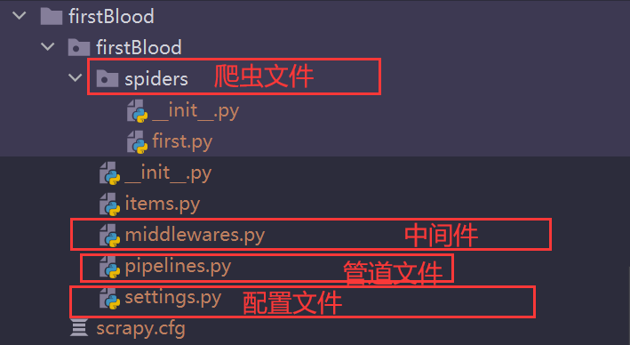

# 一、scrapy框架初识

- 什么是框架？
    - 就是一个具有很强通用性且集成了很多功能的项目模板（可以被应用在各种需求中）
- scrapy集成好的功能：
    - 高性能的数据解析操作（xpath）
    - 高性能的数据下载
    - 高性能的持久化存储
    - 中间件
    - 全栈数据爬取操作
    - 分布式：redis
    - 请求传参的机制（深度爬取）
    - scrapy中合理的应用selenium

- 环境的安装
    * `pip3 install wheel`

    * 下载`twisted`:chttp://www.lfd.uci.edu/~gohlke/pythonlibs/#twisted

    * 进入下载目录，执行 `pip3 install Twisted‑17.1.0‑cp35‑cp35m‑win_amd64.whl`

    * `pip3 install pywin32`

    * `pip3 install scrapy`

# 二、基本使用

## 2.1 创建工程

- `scrapy startproject ProName`: 创建项目
- `cd ProName`: 进入项目目录
- `scrapy genspider spiderName www.xxx.com`: 创建爬虫文件
- 编写代码
- `scrapy crawl spiderName`: 执行
- `settings`:
    - 不遵从`robots`协议: `settings.py`中修改`ROBOTSTXT_OBEY = False`
    - `UA`伪装: `settings.py`中修改`USER_AGENT`
    - `LOG_LEVEL = 'ERROR'`: 日志等级
    - `LOG_FILE = 'file.log'`: 日志保存位置

## 2.2 目录结构


**first.py**: 爬虫文件

```python
import scrapy


class FirstSpider(scrapy.Spider):
    name = 'first'  # 爬虫文件的名称, 爬虫源文件的唯一标识
    # allowed_domains = ['www.baidu.com', 'www.sogo.com']  # 允许的域名, 通常进行注释
    start_urls = ['https://dig.chouti.com/']  # 起始的url列表, scrapy会自动的获取url发起请求

    # 解析响应数据
    def parse(self, response):
        pass
```

* `name`: 爬虫文件的名称, 爬虫源文件的唯一标识
* `allowed_domains`: 允许爬取的域名，通常不使用
* `start_urls`: 爬虫起始url
* `parse`: 解析数据方法

`scrapy`会使用`start_urls`中的url自动发起请求，将响应保存在`response`中。

## 2.3 数据解析

`scrapy`解析数据是基于`xpath`进行数据解析。将`xpath`封装到了`response`对象中。

```
response.xpath("xpath表达式")
```

该方法返回的是一个`Selector`对象列表， 想要获得数据需要调用`Selector`对象的`extract()`方法

**作用在`Selector`对象列表上的解析方法**

* `Selector对象列表.extract()`: 获取列表中所有`selector`对象保存的数据
* `Selector对象列表.extract_first()`:  获取列表中第一个`selector`对象保存的数据

## 2.4 数据存储

`scrapy`保存数据有两种方法，一种是**基于终端指令方式**，一种是**基于管道方式**

### 2.4.1 基于终端指令的存储方式

在爬虫文件中编写如下代码，`parse`方法返回值要是一个`key-value`**键值**或`key-vaue`
**嵌套在可迭代对象中**，

```python
import scrapy


class FirstSpider(scrapy.Spider):
    name = 'first'  # 爬虫文件的名称, 爬虫源文件的唯一标识
    # allowed_domains = ['www.baidu.com', 'www.sogo.com']  # 允许的域名, 通常进行注释
    start_urls = ['https://dig.chouti.com/']  # 起始的url列表, scrapy会自动的获取url发起请求

    # 解析响应数据
    def parse(self, response):
        content = []

        div_list = response.xpath('/html/body/main/div/div/div[1]/div/div[2]/div[1]/div')
        for div in div_list:
            title = div.xpath('./div/div/div/a/text()').extract_first()
            content.append({"title": title})

        return content
```

当执行爬虫文件时指定数据保存文件: `scrapy crawl first -o file.csv`

基于终端指令的存储方式存在较大的局限性，

* **只可以将`parse`方法的返回值存储到磁盘文件中**
* 文件的后缀只能是`.csv .xsl .json`等文件，不能写入数据库

### 2.4.2 基于管道方式的数据存储

创建`scrapy`项目时，自动为我们创建了一个`pipelines.py`的文件，该文件时用于编写 数据存储管道的文件。

**使用`pipelines.py`的流程如下**

- 编码流程：
    1. 数据解析
    2. 在`item`的类中定义相关的属性: 创建项目时生成了`items.py`，该文件用于定义和保存存储数据的中间者`item`
    3. 将解析的数据存储封装到`item`类型的对象中 `item['p']`
    4. 将`item`对象提交给管道
    5. 在管道类中的`process_item`方法负责接收`item`对象，然后对`item`进行任意形式的持久化存储
    6. **在配置文件中开启管道**
    ```
    ITEM_PIPELINES = {
       'firstBlood.pipelines.FirstbloodPipeline': 300,  # 300 表示优先级，数值越小，优先级越高
    }
    ```

**items.py**

```python
import scrapy


class FirstbloodItem(scrapy.Item):
    # define the fields for your item here like:
    # name = scrapy.Field()
    title = scrapy.Field()  # 万能数据类型，可以保存任何类型的数据
```

* `item`类继承了`scrapy.Item`类型
    * `scrapy.Item`: 重写了`__getitem__` `__getattr__` `__setitem__` `__setattr__`
    * 这样调用和设置属性就可以通过`[]`的形式进行设置
* 在`item`类中使用`scrapy.Fied()`定义任何类型变量

**pipelines.py**

```python
from itemadapter import ItemAdapter


class FirstbloodPipeline:
    fp = None

    def open_spider(self, spider):
        """
        该方法只会在爬虫执行时打开一次
        :param spider:
        :return:
        """
        self.fp = open('file.txt', 'w', encoding='utf-8')

    def process_item(self, item, spider):
        title = item['title']
        self.fp.write(title + '\n')
        return item  # 提交给下一个pipeline执行

    def close_spider(self, spider):
        """
        该方法只会在爬虫结束时调用一次
        :param spider:
        :return:
        """
        self.fp.close()
```

* 该文件中的一个管道类表示将数据存储到某一种形式的平台中

* 该类使用到动态语言特性**鸭子类型**
    * `open_spider`和`close_spider`这两个方法必须写成这样的名字
    * `open_spider`: 该方法在爬虫执行时调用一次
    * `close_spider`: 该方法在爬虫退出时调用一次

* `process_item`: 该方法是用于处理`item`，`item`中的数据都是在该方法中进行保存，
    * `return item`的作用是将`item`传递给优先级较低的`Pipeline`类中

**first.py**

```python
import scrapy

from ..items import FirstbloodItem


class FirstSpider(scrapy.Spider):
    name = 'first'  # 爬虫文件的名称, 爬虫源文件的唯一标识
    # allowed_domains = ['www.baidu.com', 'www.sogo.com']  # 允许的域名, 通常进行注释
    start_urls = ['https://dig.chouti.com/']  # 起始的url列表, scrapy会自动的获取url发起请求

    def parse(self, response):
        div_list = response.xpath('/html/body/main/div/div/div[1]/div/div[2]/div[1]/div')
        for div in div_list:
            title = div.xpath('./div/div/div/a/text()').extract_first()
            item = FirstbloodItem()  # 一个地下只能保存一次循环中的值
            # item.title = title
            item['title'] = title  # 对象通过[]调用或设置属性。重写 __setitem__和__getitem__
            yield item  # 将item对象提交给管道
```

* 该文件是爬虫文件，用于解析数据，并将数据封装到`item`类的对象中。

**可以在项目根目录下写一个启动文件`run.py`，内容如下**

```python
from scrapy import cmdline

cmdline.execute(['scrapy', 'crawl', 'spiderName'])
```

只需要执行该文件就可以启动`scrapy`

**日志配置, 在配置文件中增加如下代码**: 该配置会将日志文件记录

```python
from datetime import datetime

BOT_NAME = 'huyaSpider'

SPIDER_MODULES = ['huyaSpider.spiders']
NEWSPIDER_MODULE = 'huyaSpider.spiders'

today = datetime.now()
log_file_path = 'logs/scrapy_{}_{}_{}.log'.format(today.year, today.month, today.day)
LOG_LEVEL = 'WARING'
LOG_FILE = log_file_path
```

这样配置后，终端将不在输出日志信息

如果想在控制台输出日志需要自定义日志处理文件`logger.py`

```python
import logging

# 创建日志记录器
streamLogger = logging.getLogger('stream')
streamLogger.setLevel(logging.INFO)
# 创建日志处理器
streamHandler = logging.StreamHandler()
# 创建日志格式器
formatter = logging.Formatter(fmt='%(asctime)s -- %(name)s -- %(filename)s -- %(levelname)s -- %(message)s')  # 日志格式控制
# 设置日志处理器使用的日志格式器
streamHandler.setFormatter(formatter)
# 日志记录器中添加日志处理器
streamLogger.addHandler(streamHandler)
```

在要需要输出日志的位置使用即可

## 2.5 案例，爬取虎牙直播间

该案例爬取虎牙直播间的标题(`title`)、主播名称(`anchor`)、热度(`hot`)

**创建项目**: `scrapy startproject huyaSpider`

**创建爬虫**: `cd huyaSpider && scrapy genspider huya www.xxx.com`

**基本配置文件的修改**
```python
ROBOTSTXT_OBEY = False  # 不遵循robots协议
# 设置User-Agent
USER_AGENT = "Mozilla/5.0 (Windows NT 10.0; Win64; x64) AppleWebKit/537.36 (KHTML, like Gecko) Chrome/89.0.4389.72 Safari/537.36"
```

**日志**: `scrapy`日志配置
```python
from datetime import datetime

today = datetime.now()
log_file_path = 'logs/scrapy_{}_{}_{}.log'.format(today.year, today.month, today.day)
LOG_LEVEL = 'DEBUG'
LOG_FILE = log_file_path
```
* 该配置生效后，终端不在输出日志

**自定义日志处理输出到终端**: 基于`logging`模块
```python
import logging

streamLogger = logging.getLogger('stream')
streamLogger.setLevel(logging.INFO)
streamHandler = logging.StreamHandler()
formatter = logging.Formatter(fmt='%(asctime)s -- %(name)s -- %(filename)s -- %(levelname)s -- %(message)s')  # 日志格式控制
streamHandler.setFormatter(formatter)
streamLogger.addHandler(streamHandler)
```
* 在项目目录下的`huyaSpider`新建文件`logger.py`键入如上内容
* 在需要输出日志的位置输出即可

### 2.5.1 项目开始
经过以上配置，可以开始编写爬虫了

**`spiders/huya.py`文件**
```python
import scrapy
from ..items import HuyaspiderItem

class HuyaSpider(scrapy.Spider):
    name = 'huya'
    # allowed_domains = ['www.xxx.com']
    start_urls = ['https://www.huya.com/g/wzry']

    def parse(self, response):
        li_list = response.xpath('//*[@id="js-live-list"]/li[position()>6]')
        for li in li_list:
            title = li.xpath('./a[2]/text()').extract_first()
            anchor = li.xpath("./span/span[1]/i[@class='nick']/text()").extract_first()
            hot = li.xpath('./span[@class="txt"]/span[@class="num"]/i[2]/text()').extract_first()
            item = HuyaspiderItem()
            item['title'] = title
            item['anchor'] = anchor
            item['hot'] = hot
            yield item
```
该文件是用于编写定制爬虫规则的文件，主要用于爬虫解析数据的编写和
将解析出的数据交给`item`，每个`item`都是一个新的实例。

**`items.py`文件**
```python
import scrapy


class HuyaspiderItem(scrapy.Item):
    # define the fields for your item here like:
    # name = scrapy.Field()
    title = scrapy.Field()
    anchor = scrapy.Field()
    hot = scrapy.Field
```
该文件中的类主要是用于临时加载数据，将数据传递给需要的`pipelines`对象

**`pipelines.py`文件**
```python
import json
import pymysql
from  .logger import streamLogger


class HuyaspiderPipeline:
    """
    该pipeline用于将数据写入文件
    """
    fp = None
    huya_list = []

    def open_spider(self, spider):
        """
        打开文件
        :param spider:
        :return:
        """
        self.fp = open('huya.json', 'w', encoding='utf-8')

    def process_item(self, item, spider):
        """
        具体存储数据的过程
        :param item:
        :param spider:
        :return:
        """
        title = item['title']
        anchor = item['anchor']
        hot = item['hot']
        dic = {"title": title, 'anchor': anchor, 'hot': hot}
        self.huya_list.append(dic)
        streamLogger.info(f"添加数据{dic}")
        return item

    def close_spider(self, spider):
        """
        关闭文件
        :param spider:
        :return:
        """
        json.dump(self.huya_list, self.fp, ensure_ascii=False)
        streamLogger.info(f'保存数据{self.huya_list}')
        self.fp.close()


class HuyaspiderMysqlPipeline:
    """
    该pipeline用于将数据写入mysql
    """
    connection = None
    cursor = None

    def open_spider(self, spider):
        """
        建立数据库链接，如果表不存在，则创建
        :param spider:
        :return:
        """
        db_config = {
            "host": '127.0.0.1',
            "port": 3306,
            'user': 'root',
            'password': 'dyp1996',
            'db': 'huya',
            'charset': 'utf8',
        }
        self.connection = pymysql.connect(**db_config)
        self.cursor = self.connection.cursor()
        # 创建表需要约定主键为自增长
        # sql = "create table if not exists huya(id int auto_increment primary key, title varchar(255), anchor varchar(255), hot varchar(255));"
        # self.cursor.execute(sql)

    def process_item(self, item, spider):
        """
        具体存储数据的过程
        :param item:
        :param spider:
        :return:
        """
        title = item['title']
        anchor = item['anchor']
        hot = item['hot']
        sql = 'insert into huya(title, anchor, hot) value(%s, %s, %s);'
        try:
            self.cursor.execute(sql, (title, anchor, hot))
            self.connection.commit()
            streamLogger.info(f"执行sql: {sql}, 插入数据为: [{title, anchor, hot}]")
        except Exception as e:
            self.connection.rollback()
            streamLogger.error(f"执行sql: {sql}, 插入数据为: [{title, anchor, hot}] 执行出错{e}")
        return item

    def close_spider(self, spider):
        """
        关闭数据库链接
        :param spider:
        :return:
        """
        self.connection.commit()
        self.cursor.close()
        self.connection.close()
```
该文件用于编写数据存放的过程，每一种数据存放形式，都对应这一个`pipeline`类

**到`settings.py`中进行配置`ITEM_PIPELINES`**
```python
ITEM_PIPELINES = {
   'huyaSpider.pipelines.HuyaspiderPipeline': 300,
   "huyaSpider.pipelines.HuyaspiderMysqlPipeline": 200,
}
```

该项目基本完成。

之后就可以运行测试。在项目目录下编写运行文件`run.py`
```python
from scrapy import cmdline

cmdline.execute(['scrapy', 'crawl', 'huya'])
```
只需要运行该文件，即可运行爬虫
